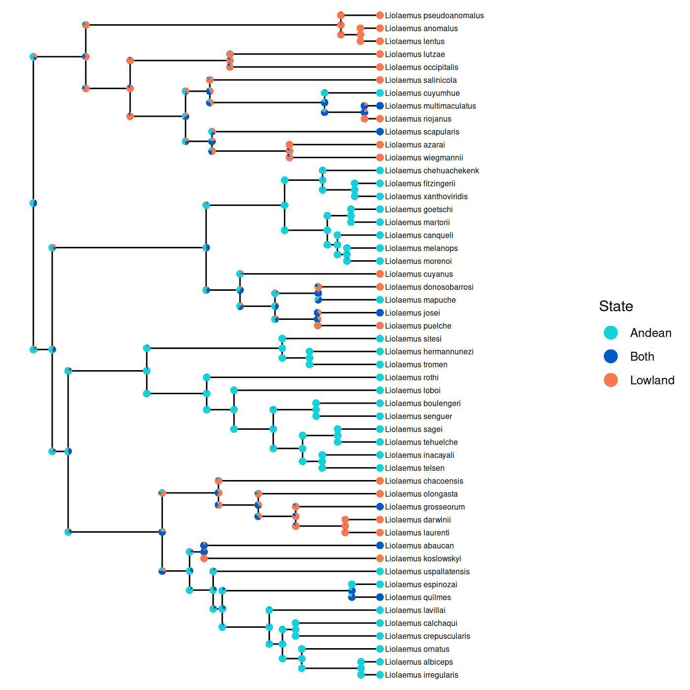

.. _Advances_Features:

Advanced Features
=================

.. _Ancestral_State_Reconstruction:

Ancestral State Reconstruction
------------------------------

Ancestral states of discrete characters can be estimated with phyddle.
Phyddle will take trees with tip states and ancestral states at internal node as training data.
For empirical trees, phyddle takes the tip states and the tree as input and estimates the character state at every internal node.
Phyddle supports ancestral state estimation of discrete characters only.
It typically assumes that there is a single character (though see :ref:`Models with state changes at cladogenesis <ASR_cladogenic>` to see how multiple regions may be used as tip states for a GeoSSE model).

Below is an example of the final result of a phyddle ancestral state reconstruction analysis. 
The geographic range of a subclade of the genus *Liolaemus* was reconstructed using a GeoSSE model.
Phyddle produces annotated tree files, which can be visualized with standard tree viewing/plotting software. 

Preparing training data
^^^^^^^^^^^^^^^^^^^^^^^
To estimate ancestral states, the internal nodes must be named in the input phylogenies.
There is no required format for the names, though characters used in Newick formatting such as paratheses, commas, and brackets should not be used in internal node names.
In addition to the standard files needed for an analysis, such as the ``.dat.cvs``  ``.labels.csv``,  and ``.tre`` files , a file ``prefix.idx.anc_state.csv`` is required for each simulated dataset. 
This should contain the node names in the first column and the ancestral state in the second column, separated by a comma.
This file should be produced by the simulation script. 
The ancestral states should be numeric and zero indexed. 
Phyddle will still run if the state are not zero indexed, but the states will be zero indexed internally which will be reflected in the output.
Below is an example for a tree with 9 internal nodes and a binary character. In this example, node9 has a true history of being in state 0 and node8 is in state 1. 

.. code-block::

  node9,0
  node8,1
  node1,1
  node2,1
  node5,0
  node3,0
  node6,1
  node7,1
  node4,1

Downsampling is not implemented with ancestral state reconstruction since different ancestral nodes will be present with different samples. 
If any of the trees are larger than the specified maximum tree size (``tree_width``), trees should be subsampled in the simulation script.

Ancestral state can be estimated three ways with phyddle.  
Only one ancestral state estimation option should be specified at a time. 

Marginal Estimation (preferred method)
^^^^^^^^^^^^^^^^^^^^^^^^^^^^^^^^^^^^^^
The marginal estimation method estimates the ancestral state for each node in the phylogeny as a categorical variable. 
With a maximum tree size (``tree_width``)  of n, there will be n-1 categorical variables corresponding 
to ancestral states.
To use the marginal estimation method, set ``asr_est = 'T'`` in the config file. 
This will create ``tree_width - 1`` categorical variables to estimate, one for each internal node
in the tree, plus additional zero-padded states for non-existent internal nodes if the tree is smaller than ``tree_width``.
These are labeled ``asr_0``, ``asr_1``, etc. 
The additional zero-padded states can generally be ignored, though they are included in 
the plot summaries and may need to be removed to assess performance for variable sized trees.
We suggest that the marginal method is used since it scales better than the other options to estimate ancestrals states.

Joint Estimation
^^^^^^^^^^^^^^^^
For the joint estimation method, a single cateogorical variable is estimated for the
entire tree. 
There are s^(n-1) categories, where n is the number of tips (``max_num_taxa``) and s is the number of possible states for the character. 
To use the joint estimation method, set ``asr_est = 'T'`` and ``asr_1_cat = 'T'``  in the config file. 
``num_states`` should be equal to s^(n-1). 
For example, for a binary character on trees with 4 tips the config file should include

.. code-block::

  'num_char'          : 1,                # number of evolutionary characters
  'num_states'        : 8,                # number of states per character
  'asr_est'           : 'T',              # estimate ancestral states
  'asr_1_cat'         : 'T',              # estimate a single categorical variable for ancestral states

  'min_num_taxa'      : 4,               # Minimum number of taxa allowed when formatting
  'max_num_taxa'      : 4,               # Maximum number of taxa allowed when formatting
  'tree_width'        : 32,

``num_states`` is equal to (2 states)^(3 internal nodes) = 8.
The ``tree_width`` may be larger than the maximum number of taxa. 
With only 4 tips, kernel default settings may have to be changed to use a smaller tree width.
This method is not expected to work well with more than a small number of taxa or states since the number of categories scales exponentially.

Single Node Estimation
^^^^^^^^^^^^^^^^^^^^^^
In the single node estimation method, the name of single node is given as input 
and the ancestral state for that node alone is estimated. To estimate with this method, 
set ``asr_one = 'T'`` in the config file. 
Additionally, the parameters to estimate should include ``asr_node_state`` and the parameters to treat as data should include ``asr_node_id``, as shown below. 
``asr_node_id`` is the name of the node in the tree file and ``asr_node_state`` is the ancestral state of the node. 
Note that ``asr_node_id`` should be listed as a categorical variable, even though it is a string. 
Phyddle correctly handles the type of ``asr_node_id`` even though they appear not to match.

This method may not scale well with tree size as only a single node per tree is used for training. 
This may result in requiring much larger training datasets than the other methods.

.. code-block::

  'asr_one'           : 'T',
  'param_est'         : {'asr_node_state'  : 'cat'},
  'param_data'        : {'asr_node_id'     : 'cat'},

The internal node name and the true ancestral should be provided in the ``labels.csv`` file, as shown below.
In the example, the ancestral state should be estimated for node1 and the true ancestral state is 1.
The true state can be left out for empirical data.

.. code-block::

  asr_node_id,asr_node_state
  node1,1

.. _ASR_cladogenic:

Models with state changes at cladogenesis
^^^^^^^^^^^^^^^^^^^^^^^^^^^^^^^^^^^^^^^^^
For some models, such as GeoSSE, states may change at cladogenesis.
This means the parent and daughters may not all have the same states. 
This description will use a GeoSSE model as an example, but other models with state changes at cladogenesis should work similarly.

GeoSSE models ranges as a collection of one or more discete regions. 
In this example, there are two regions, A and B and a lineage may be in region A, region B, or both regions A and B. 
The GeoSSE model allows parents and daughters to have different states immediately before and immediately after cladogenesis, but limits the possible combination of parent and daughter states.
The 8 allowed transitions with 2 regions are listed below. 
For full description of the model, see Goldberg et al. 2011. 
In principle, only the parent state could be estimated or the three states could be encoded as a single state without discriminating between which daughter is left vs right. 
In practice, this does not appear to work very well. 

Instead, the user can assign ancestral states that differentiate the left vs right daughters. 
Phyddle does not need to know anything about the underlying model to do inference.
It takes as input categorical internal node states and tip states, where the categories are specified with integers.
This allows for substantial flexibility, but requires the user to formulate the training data in terms of integers.
Thus, the user needs to assign integer values to each possible combination of internal states.
These should be generated by the simulation script and be used in the ``anc_state.csv`` files.
For example, the ancestral states for a GeoSSE model could be encoded as follows, where the first value represents the encoding for the ancestral state and to the left of the colon are the states in the order parent->left,right.
Note that  AB->A,B and AB->B,A have different ancestral states, since the states A and B are in different daughters.

.. code-block::
 
   0: A  -> A ,  A
   1: B  -> B ,  B
   2: AB -> A ,  B
   3: AB -> B ,  A
   4: AB -> AB,  A
   5: AB -> A , AB
   6: AB -> AB,  B
   7: AB -> B , AB

Again, phyddle is never given the mapping of the numbers 0-7 to the geographic ranges.
It only uses the 0-7 encoding. 
The order of the states is arbitrary.
In the above example, states 2 and 3 are different, since the left daughter is in state A for 2 but the right daughter is in state A for state 3. 
However, phyddle rotates the internal nodes in the tree during formatting.
Thus, the user must specify which states are the same with the nodes rotated using ``asr_rotate`` in the config file.
In the example, the pairs of states (2,3), (4,5), and (6,7) have the same parent and daughter states with the daughters rotated.

.. code-block::

  'asr_rotate'        : {2 : 3,
                         3 : 2,
                         4 : 5,
                         5 : 4,
                         6 : 7,
                         7 : 6 },

.. warning::
    
   Many simulation methods where states can change at cladogenesis have a default for how states are inherited. For example, in a GeoSSE model if a parent with range AB has a daughters with range A and  a daughter with range B, the left daughter may always be in range A and the right daughter may always be in range B. 
   While this should not cause issues for likelihood based methods, this may cause issues for ancestral state estimation using machine learning as not all patterns will be present in the data, particulary at the tips. To address this, the nodes in the tree can be randomly rotated before writing the tree to file.

Interpreting the output
^^^^^^^^^^^^^^^^^^^^^^^^
There are two main ways to view the results. 
The first is to look at the raw tables of estimates from phyddle, which include the estimates of every state at every node. 
The other way is to use the annotated tree files, which may be easier.
These can be opened with programs such as
`figtree <https://github.com/rambaut/figtree/>`__ and `RevGadgets <https://github.com/revbayes/RevGadgets>`__.  
If the user is only interested in ancestral states on empirical trees, they can safely skip to the :ref:`Producing nexus files <nexus_files>` section.

.. _index_nodes:

Indexing Nodes
""""""""""""""

Before looking at the raw tables of output from phyddle, it is neccesary to understand how phyddle indexes the ancestral state variables. 
Phyddle always estimates the same variables given a particular trained network. 
To allow for different node names on different trees, each internal node is assigned an index from 0 to n-1, where  n is the number of taxa, according to an inorder traversal on the formatted tree. 
This ordering may also improved phyddle's performance.
For both the marginal and joint estimation methods, the mapping of the the original internal node names to the phyddle node indeces are written to a file in the ``sim_dir`` for the simulated with the suffix ``node_label.csv``, such as shown below for an original tree with 9 internal nodes. 
For empirical data, these files will appear in the ``emp_dir``.
For this example, the variable ``asr_0`` will correspond to the ancestral state at node9 in the original tree. 
Then, when using with the marginal estimation strategy, the variables to estimate are ``asr_0``, ``asr_1``, ... ``asr_(n-1)`` where n is the ``tree_width``.

   
.. code-block::

  original,new
  node9,0
  node8,1
  node1,2
  node2,3
  node5,4
  node3,5
  node6,6
  node7,7
  node4,8

In the joint estimation strategy, a file ``state_mapping.csv`` will be written in the ``fmt_dir``. 
This file contains the states inferred by phyddle and that internal nodes states with which they correspond. 
For example, with a 4 tip tree and 2 states, the file is 

.. code-block::

  # state,node_0,node_1,node_2
  0,0,0,0
  1,0,0,1
  2,0,1,0
  3,0,1,1
  4,1,0,0
  5,1,0,1
  6,1,1,0
  7,1,1,1

For example, if state 1 is inferred by phyddle, the internal nodes with indeces 0 and 1 have ancestral state 0 and the internal node with index 2 has ancestral state 1. 

With the single node strategy, the variable to estimate is called ``asr_node_state`` and understanding the indexing is not required for the user. 

.. _output_file:

Output files
""""""""""""

One way to view the output is to look at the output files that phyddle produces for all analyses, such as the plots in ``plt_dir`` and the csv in ``est_dir``. 
Note that in the plots for the simulated data, the performance is averaged across all trees. 
When the trees are smaller than the ``tree_width``, zero-padding is used for the additional nodes. 
This means that if the trees are variably size, the network is estimating the location of the zero-padding for smaller tree instead of an actual ancestral state for some estimated variables. 
This may appear to inflate the performance for larger node numbers in the test dataset.

To avoid this, the user may wish to use the csv files in ``est_dir`` and remove the estimates that do not correspond to real nodes on the tree. 
To look at individual trees, the user can match the node names with the node indeces used in phyddle  using ``node_label.csv`` file to find the estimates in the output csv file.
If the option ``asr_rotate`` was used, the results should be viewed on the formatted tree, which has the suffix ``form.tre`` rather than the original tree.
This option is for models where the left vs right orientation of the daughters changes the ancestral state reconstruction.

For example for the marginal estimation strategy, the first part of the first two lines output in the file ``estimate/prefix.test_est.labels_cat.csv`` are shown below.
The first row is the header. 
It is truncated for brevity. 
On the next line, the first value is the replicate index, ``idx``.
Then, the probabilities of states 0-7 are shown for node 0. 
Next, is the probability of state 0 for node 1.
The probabilities of states 1-7 for node 1 and all the probabilities for the rest of the nodes are not shown for brevity.
Note that the length of each row for a given analysis will be the same independent of the tree size. 
With variable tree sizes, estimates corresponding to nodes that do not exist the tree should be ignored. 
To determine which node is node 0, find the row in ``node_label.csv`` with a 0 in the second column. 
The first column will contain the node label from the input tree (see :ref:`index_nodes`).

.. code-block::

  idx,asr_0_0,asr_0_1,asr_0_2,asr_0_3,asr_0_4,asr_0_5,asr_0_6,asr_0_7,asr_1_0,...
  1,3.1077805906534195e-02,1.9622480869293213e-01,2.8395557403564453e-01,2.9170775786042213e-02,5.0005137920379639e-02,7.8246846795082092e-02,2.7133193612098694e-01,5.9987157583236694e-02,1.8698431551456451e-01,...

.. _nexus_files:

Producing nexus files
^^^^^^^^^^^^^^^^^^^^^

Viewing the standard phyddle output files may be tedious since the mapping between the node names and the indeces in phyddle will be different for every tree.
As a more user friendly way to view results on a single tree at a time, phyddle can write the inferred ancestral states to a nexus file when the marginal inference method is used. 
By default, nexus files are created for the empirical data, but not the test data.
The defaults can be changed using ``asr_nexus_emp`` and ``asr_nexus_test``.
The trees are written to either ``emp_dir`` and/or ``sim_dir`` to files with the suffix ``est.tre``.
The ancestral states are written as annotations in the tree.
``anc_state_1`` corresponds to the ancestral state with the highest probability, ``anc_state_2`` to the state with the second highest probability, etc. 
``anc_state_1_pp`` is the probability of the state with the highest probability. 
The other states are labeled similarly. 
These labels will match the numbering used internally in phyddle, which are zero indexed. 
If the training data had ancestral states labeled as 1 or 2, the inferred ancestral states will be 0 or 1. 
The tip states are annotated with the labels used in ``dat.csv``.

RevBayes/RevGadgets compatible nexus files can be produced instead of the above format by specifying ``asr_rb_nexus = 'T'`` in the config file. 
This format only records up to 3 ancestral states per node and adds the probability of additional ancestral states to an other state category. 
If there are data for multiple characters at the tips, the option ``asr_map_tip_states`` must be included to use the RevBayes compatible nexus files. 
This option specifies a dictionary where the key is the desired state number and the value is the data at the tips in the same order specified in the ``.dat.csv`` file. 
For example, in the ``.dat.csv`` beginning as shown below, each species is either present or absent in region1 and region2. 
Note that no species is present in neither region in this example. 

.. code-block::

  taxa,region1,region2
  sp1,1,1
  sp2,1,0
  sp3,0,1
  ...

Then ``asr_map_tip_states`` dictionary should have 3 states corresponding the 3 possible patterns of presence and absence. In the example below, state 2 will be recorded in the nexus files for tip species in both regions.

.. code-block::

   'asr_map_tip_states' : {0 : [1, 0],
                           1 : [0, 1],
                           2 : [1, 1]},

For models where states can change at cladogenesis, rather than annotating the states at the node as a triplet, the start and end state can be annotated on each branch. 
To do this, use ``asr_map_triplet_states`` in the config file.
This specifies a dictionary where the key is the label in training data and the value is the parent, left daughter, and right daughter. 
The values should be numeric, separated by commas, and enclosed in parenthesis, as shown below.
The keys should match how the simulation script encoded the node labels, except if the original labels were not zero indexed. 
If the original labels were not zero indexed, they should be shifted to start a 0 and go to n-1 for n possible categories. 
In this example, the ancestral states in ``.anc_state.csv`` were integers between 0 and 7. 

.. code-block::

    'asr_map_triplet_states' : { 0: (0, 0, 0),       # A  -> A ,  A
                                 1: (1, 1, 1),       # B  -> B ,  B
                                 2: (2, 0, 1),       # AB -> A ,  B
                                 3: (2, 1, 0),       # AB -> B ,  A
                                 4: (2, 2, 0),       # AB -> AB,  A
                                 5: (2, 0, 2),       # AB -> A , AB
                                 6: (2, 2, 1),       # AB -> AB,  B
                                 7: (2, 1, 2)},      # AB -> B', AB

In the example, nodes inferred to be in categories 2-7 had parents in state 2 (AB).
This format can be used with plotting functions within RevGadgets, such as ``plotAncStatesPie``.

Tutorial: Markov model
^^^^^^^^^^^^^^^^^^^^^^

This tutorial walks through a phyddle analysis for ancestral state reconstruction
with a Markov model using an R-based simulator. It assumes
that you have access to the ``./workspace`` example projects bundled
with the phyddle repository.
This tutorial assumes you know how to run a phyddle analysis without ancestral state reconstruction.
If you haven't looked at the general :ref:`Tutorial`, start there and come back after you've familiarized yourself.

This tutorial explains how to:

- Understand and modify the :ref:`Simulate` script, ``sim_tree.R``
- Understand and modify the :ref:`Configuration` files for ancestral state reconstruction, ``config.py``

This project will use ``R``, ``castor``, ``extraDistr``, and ``dispRity`` to simulate training
datasets. Make sure they are installed:

.. code-block:: shell

   # install R packages
   Rscript -e 'install.packages(c("castor", "extraDistr", "dispRity"), repos="https://cloud.r-project.org")'
  

Then, to run a phyddle analysis for ``ancestral_state_mk`` using 50,000
simulated training examples, type: 

.. code-block:: shell

  # enter bisse_r project directory
  cd workspace/ancestral_state_mk
  
  # run phyddle analysis
  phyddle -c config.py 
  
  # analysis runs
  # ...
  
  # view results summary
  open plot/out.summary.pdf

Great, we ran an analysis! But how does it work? Now we'll walk through aspects of the pipeline that are different for ancestral state reconstruction, largely focusing on the simulation step.

Simulation Script
"""""""""""""""""

First we load the required R packages and disable warnings. 

.. code-block:: R 

  #!/usr/bin/env Rscript
  library(castor)
  library(dispRity)
  library(extraDistr)

  # disable warnings
  options(warn = -1)

Next, we read in our command-line arguments:

.. code-block:: R 

  # arguments
  args        = commandArgs(trailingOnly = TRUE)
  out_path    = args[1]
  out_prefix  = args[2]
  start_idx   = as.numeric(args[3])
  batch_size  = as.numeric(args[4])
  rep_idx     = start_idx:(start_idx+batch_size-1)
  num_rep     = length(rep_idx)

After that, we create filenames for the output that phyddle expects. 
Note we have an additional file in comparison to standard phyddle analyses, ending in ``.anc_state.csv`` we need to create.

.. code-block:: R 

  # filesystem
  tmp_fn      = paste0(out_path, "/", out_prefix, ".", rep_idx)   # sim path prefix
  phy_fn      = paste0(tmp_fn, ".tre")                            # newick file
  dat_fn      = paste0(tmp_fn, ".dat.csv")                        # csv of data
  lbl_fn      = paste0(tmp_fn, ".labels.csv")                     # csv of labels (e.g. params)
  asr_true_fn = paste0(tmp_fn, ".anc_state.csv")                  # csv of labels (e.g. params)

Next we set the number of states of our character and the minimum and maximum tree size.
 
.. code-block:: R 

  # dataset setup
  num_states = 2
  
  minTreeSize = 10 
  maxTreeSize = 50 
  
  # Set minimum tree size
  tree_width = minTreeSize 

The main simulation loop then generates and saves one dataset per
replicate index. Here is a simplified representation for a two-state
Markov model for ancestral state estimation for how the simulation loop works:

.. code-block:: R 

  # simulate each replicate
  for (i in 1:num_rep) {
   
  	# set RNG seed
        # ...
  	
  	# rejection sample
  	num_taxa = 0
  	while (num_taxa < tree_width +1) {
  
  		# Draw tree size
                # ...
  		
                # Simulate birth rate
                # ...
  		
                # Simulate death rate
                # ...
  		
  	        # Simulate the tree	
                # ...
  		
  		# check if tree is valid
                # ...
  	}
  
      
  	# save tree
        # ...
  
  	# drop one of tips with zero branch length
        # ...
  
        # Label the internal nodes and write the tree to file
        # ...
  
  	# simulate transition parameters and create Q matrix
        # ...
        
        # Simulate character data
        # ...
  
        # save tip data
        # ...
  
        # save learned labels (e.g. estimated data-generating parameters)
        # ...
  
        # save the ancestral states
        # ...
  
  }
  
  
  # done!
  
Now we'll look at each part of the simulation loop. 
First, we set the seed so the simulations are reproducible. 
We do it based on the index so that the results will be indepdent
of the batch set up. We also set the number of taxa to zero.
The number to taxa is used to determine when to stop simulating trees 
for a given replicate.

.. code-block:: R 

  	# set RNG seed
  	set.seed(start_idx + i - 1)
  	
  	# rejection sample
  	num_taxa = 0
  	while (num_taxa < tree_width +1) {

Next we draw the tree size and the birth and death rates.

.. code-block:: R 
  
  		# Draw tree size
  		tree_width <- rdunif(1, minTreeSize, maxTreeSize)
  		label_names = c(paste0("anc_state_", 1:(tree_width - 1)))
  		
                # Simulate birth rate
  		log_birth = runif(1, -2, 0)
  		birth = 10^log_birth
  		
                # Simulate death rate
  		death = min(birth) * 10^runif(n=1, -2, 0)
  		log_death = log(death[1], base=10)

Now we simulate the tree using castor.
Note that we simulate one extra tip. We will later drop one of the tips
from the last speciation event. This is to avoid having zero branch lengths
from ending the simulation based on the number of taxa.
Then we check how many taxa are in the tree.

.. code-block:: R 
  		
  	        # Simulate the tree	
  		res_sim = generate_tree_hbds(max_extant_tips = tree_width + 1, 
  		                            include_extant = TRUE, 
  		                            lambda = birth, 
  		                            mu = death 
  		                  )
  		
  		# check if tree is valid
  		num_taxa = length(res_sim$tree$tip.label)

Then we find the branches with zero branch lengths, which correspond to the last speciation event. 
We then drop one of the two branches. 

.. code-block:: R 

  	# save tree
  	tree <- res_sim$tree

  	# drop one of tips with zero branch length
  	edge <- (which(tree$edge.length == 0)[1])
  	drop <- (tree$edge[edge,2 ])
  	tree_sim <- drop.tip(res_sim$tree, drop, trim.internal = TRUE, colapse.singles = TRUE  )

Now we label the internal nodes in the tree and save the tree. 
  
.. code-block:: R 

        # Label the internal nodes and write the tree to file
  	tree_sim <- makeNodeLabel(tree_sim, method = "number", prefix = "node")
  	write.tree(tree_sim, file=phy_fn[i])

Next we simulate the transition parameters for the Markov model
and create the Q matrix
We are using a symmetric Q matrix.

.. code-block:: R 
  
  	# simulate transition parameters and create Q matrix
  	log_state_rate = runif(1,-3,0)
  	state_rate = 10^log_state_rate
  	Q = matrix(state_rate,
  	           ncol=num_states, nrow=num_states)
  
        diag(Q) = 0
        diag(Q) = -rowSums(Q)

Using the Q matrix we just created, we simulate character data along the tree. 

.. code-block:: R 

        # Simulate character data
        characterData <- simulate_mk_model(tree_sim, Q, root_probabilities="stationary",
                      include_tips=TRUE, include_nodes=TRUE,
                      Nsimulations=1, drop_dims=TRUE)

We save the tip states. We want our states to be from 0-1, so we subtract 1 from the states.

.. code-block:: R 

        # save tip data
        state_sim = characterData$tip_states - 1
        df_state = data.frame(taxa=tree_sim$tip.label, data=state_sim)
        write.csv(df_state, file=dat_fn[i], row.names=F, quote=F)

Now we save the data generating parameters. 
In this analyses, phyddle does not actually use the data generating parameters as data or 
infer them. However, phyddle still requires the labels file exist.
It may also be useful to look at the distributions of parameters after rejection sampling
to see if the simulation settings seem reasonable. 

.. code-block:: R
  
        # save labels (e.g. data-generating parameters)
        df_label = data.frame(t( c(birth, death, state_rate)))
        colnames(df_label) <- c("birth_rate", "death_rate", "state_rate")
        write.csv(df_label, file=lbl_fn[i], row.names=F, quote=F)

Finally, we save the tip states. As with the tip data, we want our states to be from 0-1, 
so we subtract 1 from the states.
We do not want a header for this file, so we use ``write.table`` instead of ``write.csv``.

.. code-block:: R

        # save the ancestral states
        state_sim_node = characterData$node_states - 1
        df_asr = data.frame(t(state_sim_node))
        colnames(df_asr) <- paste("node", c(1:(tree_width -1)), sep = "")
        write.table(t(df_asr), file = asr_true_fn[i], quote =F, col.names =F, sep = ',')

Configure the pipeline
""""""""""""""""""""""

The config file is very similar to the config files of other phyddle analyses.
In this case, there is one additional line that turns ancestral state estimation on. 

.. code-block::

  'asr_est'            : 'T',

Additionally, there is no ``param_est``. While additional parameters could be included to estimate, 
it is not necessary to have any other parameters to estimate with ancestral state estimation.

Viewing results
"""""""""""""""

While plots are generated for ``asr_0`` through ``asr_48``, only ``asr_0`` through ``asr_8`` will accurately reflect how well phyddle is performing for estimating ancestral states. 
This is because ``asr_9`` through ``asr_48`` are for nodes that only exist in some trees. 
For trees without those nodes, phyddle should usually estimate 0 for those states. 
This may seem to artifically inflate phyddle's performance. 
Postprocessing of the files in ``estimate`` can remove nodes that do not exist in a given tree. 
See :ref:`Output files <output_file>`  for a more comprehensive description.
Alternatively, training with trees with a constant number of tips will remove this problem. 

Tutorial: GeoSSE with Empirical 
^^^^^^^^^^^^^^^^^^^^^^^^^^^^^^^

This tutorial walks through a phyddle analysis for ancestral state reconstruction
with a GeoSSE model using an R-based simulator. It assumes
that you have access to the ``./workspace`` example projects bundled
with the phyddle repository.
This tutorial assumes you know how to run a phyddle analysis without ancestral state reconstruction.
If you haven't looked at the general :ref:`Tutorial`, start there and come back after you've familiarized yourself.

This tutorial explains how to:

- Understand and modify the :ref:`Simulate` script, ``sim_geosse.R``
- Understand and modify the :ref:`Configuration` files for ancestral state reconstruction, ``config.py``
- Generate annotated phylogenies from :ref:`Estimate`

This project will use ``R``, ``diversitree``, and ``stringr`` to simulate training
datasets. Make sure they are installed:

.. code-block:: shell

   # install R packages
   Rscript -e 'install.packages(c("diversitree", "stringr"), repos="https://cloud.r-project.org")'
  

Then, to run a phyddle analysis for ``ancestral_state_geosse`` using 250,000
simulated training examples, type: 

.. code-block:: shell

  # enter bisse_r project directory
  cd workspace/ancestral_state_geosse
  
  # run phyddle analysis
  phyddle -c config.py 
  
  # analysis runs
  # ...
  
  # view results summary
  open plot/sim.summary.pdf

We've run an analysis, but now let's break down how the set up is different than analyses without ancestral state reconstruction.
This example is a bit more complicated than the ancestral state reconstruction with a Markov model since characters can change at the time of speciation.

Simulation Script
"""""""""""""""""

Let's look at the source code for ``sim_geosse.R``. 

First, we load any libraries we want to use for our simulation.

.. code-block:: R

    library(diversitree)
    library(stringr)

Next, we read in our command-line arguments:

.. code-block:: R

   args        = commandArgs(trailingOnly = TRUE)
   out_path    = args[1]
   out_prefix  = args[2]
   start_idx   = as.numeric(args[3])
   batch_size  = as.numeric(args[4])
   rep_idx     = start_idx:(start_idx+batch_size-1)

    
After that, we create filenames for the output that phyddle expects:     

.. code-block:: R

    #filesystem
    tmp_fn      = paste0(out_path, "/", out_prefix, ".", rep_idx)   # sim path prefix
    phy_fn      = paste0(tmp_fn, ".tre")                            # newick file
    dat_fn      = paste0(tmp_fn, ".dat.csv")                        # csv of data
    lbl_fn      = paste0(tmp_fn, ".labels.csv")                     # csv of labels (e.g. params)
    asr_true_fn = paste0(tmp_fn, ".anc_state.csv")                  # csv of ancestral states 

After that, we create functions that are used to get the ancestral states from the diversitree output. We'll return to this after looking at the main loop:     

.. code-block:: R

    # Get the first state along a branch (forward time)
    firstState <- function (mat) {
        ...
    }

    # Get the last state along a branch (forward time)
    lastState <- function(mat) {
        ...
    }

    # Combines triplet of states into a string
    combine_states <- function(state_table) {
        ...
    }

    # Finds ancestral state triplets for every node in the extant only tree
    # Randomly rotates nodes in the tree
    getHistory <- function(tree1, phy_file) {
        ...
    }

First, we store the names of all the parameters and the tree size.
This tree size is set to match the empirical tree size.

.. code-block:: R

    label_names = c("sA", "sB", "sAB", "xA", "xB", "dA", "dB")
    max_tax <- 52

Now, we set some initial values for current tree index, the last tree index, and the seed.
``i`` is used for the index for the file names. 
We also keep track of the number of fully extinct trees and trees with only one tip states. 
Thoses are not strictly necessary to track, but are useful to see how many simulations are 
discarded.

.. code-block:: R

    nTrees <- start_idx - 1
    nullTrees <- 0
    noVarTree <- 0
    set.seed(nTrees)
    totTrees <- start_idx+batch_size-1
    i <- 1

The main simulation loop then generates and saves one dataset per
replicate index. Here is a simplified representation for a two-region
GeoSSE model with ancestral state reconstruction for how the simulation loop works:

.. code-block:: R

    # Simulate each replicate
    while (nTrees < totTrees) {
      
      # Draw all parameters 
      # ...
      
      # Simulate tree
      # ...
    
      # Check if tree exists
        if () {
           # ...
        
        # Confirm three tip states present
        } else if () {
            # ...
        	
        # Write all relevant files for phyddle
        } else {
            # ...
            	
            # Update counters
            # ...

            # Set the seed to get the same trees independent of how phyddle is run
            # ...
        
        }
    }

Now, we'll go through all the parts of the simulation loop. 
First we draw all the parameters from an exponential distribution and save them. 

.. code-block:: R

    # Draw all parameters
    sA  <- rexp(1, 1/.1)
    sB  <- rexp(1, 1/.1)
    xA  <- rexp(1, 1/.1)
    xB  <- rexp(1, 1/.1)
    dA  <- rexp(1, 1/.1)
    dB  <- rexp(1, 1/.1)
    sAB <- rexp(1, 1/.1)
    pars <- c(sA, sB, sAB, xA, xB, dA, dB)

Then, we simulate the tree using the R package ``diversitree``. 

.. code-block:: R
   
    # Simulate tree
    tree <- tree.geosse(pars, max.taxa=max_tax, max.t=Inf, include.extinct=TRUE,
                x0=NA)
  
Since the tree includes extinct tips, we find the extand tips using the tip names.
Extant species start with "sp".

.. code-block:: R

   # Find extant tips
   extant <-  which(str_detect(tree$tip.label, "sp"))

We check if the tree exists (no full extinction), and there tree has the right number of taxa. 
If not, the ``nullTrees`` counter is incremented. 
This counter is not necessary, but may be useful to see if full extinction is common. 
This could indicate the parameter distributions should be changed. 

.. code-block:: R

   # Check if tree exists
   if (is.null(tree) | sum(str_detect(tree$tip.label, "sp"))  != max_tax ) {
        nullTrees <- nullTrees + 1
   }

Next, we confirm all the tip states are present in the extant tree.
If not, increment the counter for trees without sufficient tip state variation.

.. code-block:: R 

   # Confirm three tip states present
   else if (length(table(tree$tip.state[extant])) < 3) {
    	noVarTree <- noVarTree + 1
   }

Now that we confirmed the tree is a valid training example, we'll write all the files that phyddle needs. 
First, we find the ancestral states for each internal node using the function ``getHistory``. 
Then we write the ancestral states to file.

.. code-block:: R

   # Write all relevant files for phyddle
   else {

     stateHistory <- getHistory(tree, phy_fn[i])
     # This file is in the form
     # node, state(0-7)
     write.table(stateHistory, file = asr_true_fn[i],quote = FALSE, col.names = FALSE, sep = "," )

Next we make a dataframe to hold the tip states. 
Diversitree reports the tip states as 0 for both regions, 1 for region 1 (or A), and 2 for region 2 (or B). 
We want to save our tip state state as presence/absence for region 1 and region 2 as separate variables. 
If the state is 0 or 1, the species is present in region 1. 
If the state is 0 or 2, the species is present in region 2. 

.. code-block:: R

     df_state = data.frame(taxa=tree$tip.label, data=tree$tip.state, region1 = 0, region2 = 0)
     # In region one if state is either widespread or 1
     df_state$region1[df_state$data == 0 | df_state$data == 1] <- 1
     # In region two if state is either widespread or 2
     df_state$region2[df_state$data == 0 | df_state$data == 2] <- 1

Next, we find only the species that are extant, and include only the extant species in our dataframe. 
We also remove the original location column from the dataframe, since we only want the tip states in the form of ppresence/absence. 
Then we write the tip states to file.

.. code-block:: R
   
     extant <- which(str_detect(df_state$taxa, "sp"))
     df_state <- df_state[extant, ]
     df_state <- df_state[ ,-2]
     write.csv(df_state, file=dat_fn[i], row.names=F, quote=F)

Now we write the parameters to file.
In this phyddle analyses, we are not actually going to use the parameters. 
However, you could jointly infer the parameters or they may be helpful for understanding the results.

.. code-block:: R

     # save learned labels (e.g. estimated data-generating parameters)
     names(pars) = label_names
     df_label = data.frame(t(pars))
     write.csv(df_label, file=lbl_fn[i], row.names=F, quote=F)

We update the tree index and the file counter.

.. code-block:: R

    # Update counters
    nTrees <- nTrees + 1
    i <- i+1

Lastly, we update the seed. This is so that the same tree will be generated independent of how 
phyddle is run (with different batch sizes, for example).

.. code-block:: R

    # Set the seed to get the same trees independent of how phyddle is run
    set.seed(nTrees)
    }

Now that we've covered the big picture, we'll return to the functions at the beginning. 

These functions find the first and last states along a branch. 
They use the history reported by diversitree. 

.. code-block:: R

   # Get the first state along a branch (forward time)
   firstState <- function (mat) {
     mat[1,2]
   }
    
   # Get the last state along a branch (forward time)
   lastState <- function(mat) {
     mat[dim(mat)[1], 2]
   }

This function combines the states from the parent and two daughters into a string. 
This gives a convenient way to then assign 0-7 states from the triplets. 

.. code-block:: R

   # Combines triplet of states into a string
   combine_states <- function(state_table) {
     paste0(state_table[1], state_table[2], state_table[3])
   }

Now, we'll look at the function that finds the ancestral states.
First, we adjust the indexing used by diversitree. 
This is because they node numbers are off by one from the tree. 
Then we get the  history using ``history.from.sim.discrete``.

.. code-block:: R

   # Finds ancestral state triplets for every node in the extant only tree
   # Randomly rotates nodes in the tree
   getHistory <- function(tree1, phy_file) {
     # Fix the off by one indexing for how the history is recorded 
     tree1$hist$from <- tree1$hist$from - 1
     tree1$hist$to   <- tree1$hist$to   - 1
     h <- history.from.sim.discrete(tree1, 0:2)
     
Then we find the first and last state on every branch and copy the tree.
We are going to rotate branches on the tree so, we don't want to get rid of the original.

.. code-block:: R

     # Find the first and last state for every branch
     mat_startState <- unlist(lapply(h$history, firstState))
     mat_endState   <- unlist(lapply(h$history, lastState))
   
     # Copy original tree
     newTree <- tree1
 
Next we make a matrix that has the parent, left daughter, and right daughter for every
internal node in the tree. We do this by iterating over every edge in the edge matrix.
If the node number in the edge matrix is less than the number of tips, the node is a tip 
and otherwise it is an internal node. The first branch with a given parent in the edge 
matrix is the left branch and the second is the right. This allows us to differentiate 
between left and right daughters.

.. code-block:: R

     # Create a matrix to hold the names of the children at each node
     parent_child_matrix <- matrix(0, nrow = tree$Nnode, ncol = 2,
                                   dimnames = list(tree$node.label, c("child1", "child2")))
     
     # For every branch (edge) in the edge matrix
     # find the children labels
     for (i in 1:nrow(tree$edge)) {
       parent_node_num <- tree$edge[i, 1]
       child_node_num  <- tree$edge[i, 2]
       
       # Map node numbers to labels
       parent_label <- ifelse(parent_node_num <= length(tree$tip.label),
                              tree$tip.label[parent_node_num],
                              tree$node.label[parent_node_num - length(tree$tip.label)])
       child_label  <- ifelse(child_node_num <= length(tree$tip.label),
                              tree$tip.label[child_node_num],
                              tree$node.label[child_node_num - length(tree$tip.label)])
       
       # Determine if child is left or right child
       if (parent_child_matrix[parent_label, 1]  == 0) {
         parent_child_matrix[parent_label, 1] <- child_label
       } else {
         parent_child_matrix[parent_label, 2] <- child_label
         
       }
     }

Now we make a matrix with to store the parent node, the two children, and the child labels
and fill the matrix.
     
.. code-block:: R

     # Create a matrix to store the parent, children trios of states at internal nodes
     state_table <- matrix(NA, nrow = nrow(parent_child_matrix), ncol = 3)
     rownames(state_table) <- rownames(parent_child_matrix)
     colnames(state_table) <- c("parent", "child1", "child2")
     
     for(i in 1:nrow(parent_child_matrix)) {
       state_table[i,2] <- mat_startState[parent_child_matrix[i,1]]
       state_table[i,3] <- mat_startState[parent_child_matrix[i,2]]
   
       # If the node is not the root
       if (!is.na( mat_endState[rownames(parent_child_matrix)[i]])) {
         state_table[i,1] <- mat_endState[rownames(parent_child_matrix)[i]]
   
       # If the node is the root
       } else {
         # If the two daughters are the same, the root is the
         # same state as the daughters
         if (state_table[i,2] == state_table[i,3]) {
           state_table[i,1] <- state_table[i,2]
   
           # Otherwise, the root is widespread
           # This is only for 2 regions
         } else {
           state_table[i,1] <- 0
         }
       }
   
     }

We find the number of tips in the tree. 
Then we draw from unif(0,1) for every internal node in the tree.
Nodes with draws that are greater than 0.5 will be rotated.
Then we find the index of the nodes to rotate. 
Internal node indexes start at num_tips + 1

.. code-block:: R
   
     num_tips <- Ntip(tree)
   
     # Selects nodes in the tree to rotate
     # This is needed for phyddle to have examples of both orderings
   
     rotate_vec <- which(runif(num_tips - 1) > .5 )
     nodes_to_rotate <- num_tips + rotate_vec
   
For every node we want to rotate, we first find the branch in the edge matrix.
Then we rotate the branches and update the branch lengths. 
We also update the table of left vs right descendants. 

.. code-block:: R

     for (node in nodes_to_rotate) {
   
       # Figure out which branches to rotate based on the parent index
       branchIndex <- which(newTree$edge[,1] == node)
       one <- branchIndex[1]
       two <- branchIndex[2]
   
       # Rotate branches
       tmp <-newTree$edge[one, ]
       newTree$edge[one, ] <- newTree$edge[two, ]
       newTree$edge[two, ] <- tmp
   
       # Rotate lengths
       tmp <- newTree$edge.length[one]
       newTree$edge.length[one] <- newTree$edge.length[two]
       newTree$edge.length[two] <- tmp
   
       # Update the table of left/right descendants
       nodeName <- newTree$node.label[node-num_tips]
       tmp <- state_table[nodeName , 2]
          state_table[nodeName, 2] <- state_table[nodeName , 3]
       state_table[nodeName, 3] <- tmp
   
     }

We combine the triplet of states at each node into a single string. 
We then use the string to convert to 0-7 labels which will be used by phyddle.
   
.. code-block:: R

     comb_state <- apply(state_table, 1, combine_states)
     newStates <- sapply(comb_state, switch,
           "111" = "0",
           "222" = "1",
           "012" = "2",
           "021" = "3",
           "001" = "4",
           "010" = "5",
           "002" = "6",
           "020" = "7")

Lastly, we write the tree to file and return the states.    

.. code-block:: R

     write.tree(newTree, file = phy_file)
   
     return (newStates)
   }

The simulation script could be written to use other R packages or other programs entirely. 
The key difference from the typical simulation script is that the additional file with the suffix ``.anc_state.csv`` must be written for every dataset. 

Configure the pipeline
""""""""""""""""""""""

The config file is mostly the same as for more standard analyses. Here, we will only highlight ancestral state reconstruction specific options.  

First, ``asr_est`` should be true, which turns on estimation of ancestral states.

.. code-block:: 

  'asr_est'           : 'T', 

For models encoded as triplets where states can change at cladogenesis, like GeoSSE models in our current example, ``asr_rotate`` should be specified. This tells phyddle which states have correspond to the parent state with the same two daughter states, but with the left and right nodes reversed. 
This can be seen from the Rscript above, where the 3 state encoding (0, 1, or 2 for each parent and daughter) is turned into the 8 state encoding for each node.

.. code-block:: 

  'asr_rotate'        : {2 : 3,
                         3 : 2,
                         4 : 5,
                         5 : 4,
                         6 : 7,
                         7 : 6 },

The following options relate only to creating annotated output tree files. 
These trees are created during the estimation step. 
By default, annotated files are only created from the empirical trees. 
These trees are written to the empirical directory with the suffix ``.est.tre``.
They will not impact training. 

To write a nexus file that contains tip states when the original states were specified as presence/absence for two regions, we need to tell phyddle how to write the two variables in a single variable. 
This specifies that tips in region 1 only will be annotated with state 0, tips in region 2 only will be annotated with state 1, and tips in both regions will be annotated with state 2. 
These should match the labels in RevGadgets if it is used for plotting. 
  
.. code-block:: 

  'asr_map_tip_states'    : {0 : [1, 0],
                             1 : [0, 1],
                             2 : [1, 1]},
                          
It may be easier to think about results as the probability of each of the three possible ranges as the ancestral state for the parent and each of the two daughters, rather than the probability of each of the 8 possible triplets of states. 
``asr_map_triplet_states`` allows phyddle to annotate the internal nodes with the probability of each of the possible ranges. 
For example, the probability the parent was in AB is given by the sum of the probabilities of states 2 through 7. 
If this is not specified, phyddle will report the probabilities of each of the 8 states instead.

.. code-block:: 

  'asr_map_triplet_states' : { 0: (0, 0, 0),       # A  -> A ,  A
                               1: (1, 1, 1),       # B  -> B ,  B
                               2: (2, 0, 1),       # AB -> A ,  B
                               3: (2, 1, 0),       # AB -> B ,  A
                               4: (2, 2, 0),       # AB -> AB,  A
                               5: (2, 0, 2),       # AB -> A , AB
                               6: (2, 2, 1),       # AB -> AB,  B
                               7: (2, 1, 2)},      # AB -> B', AB

This specifies that the nexus files for the empirical data should be in RevBayes format. 
This is required to use RevGadgets, but contains less information about the less probable states in come cases.

.. code-block:: 

  'asr_rb_nexus' : 'T'
  
Using the R script plot_tree.R, which uses the pacakge RevGadgets, we can plot the empirical tree. 
The result should be similar to the figure at the beginning of :ref:`Ancestral State Reconstruction <Ancestral_State_Reconstruction>`, but may vary slightly with different trainings.

