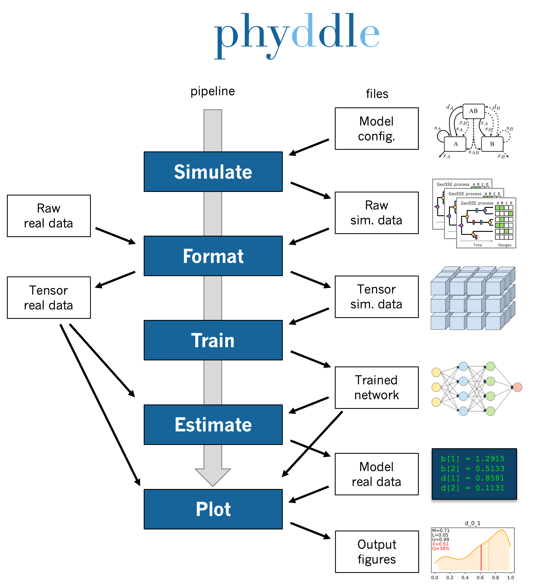

phyddle docs
============

.. note::

	**This private beta version of phyddle is still under development.** It is generally tested and stable with respect to a few use standard cases. Much of the documentation and some key features are still missing. Most phyddle development occurs on a 16-core Intel Macbook Pro laptop and a 64-core Ubuntu server, so there are also unknown portability/scalability issues to correct. Any feedback is appreciated! michael.landis@wustl.edu

**phyddle** is a pipeline-based toolkit for fiddling around with phylogenetic models and deep learning. phyddle can be installed as a Python package using pip and used for pipeline analyses using scripts provided through GitHub.

A standard phyddle analysis performs the following tasks for you:

* **Pipeline configuration** applies analysis settings provided through a config file and/or command line arguments.
* **Simulate** simulates a large training dataset under the model to be *Formatted* (parallelized, partly compressed).
* **Format** encodes the raw simulated data into tensor format for *Training*.
* **Train** shuffles and splits training data, builds a network, then trains and saves the network with the data for *Estimation*.
* **Estimate** produces model estimates for a new dataset with the trained network.
* **Plot** generates figures that summarize the training data (*Format*), the network and its training (*Train*), and any estimates for new datasets (*Estimate*).

In addition, phyddle is distributed with example scripts to simulate phylogenetic training datasets using `RevBayes <http://revbayes.com>`_, `R <https://www.r-project.org/>`_, and `MASTER <https://tgvaughan.github.io/MASTER/>`_.

To learn how to use phyddle, we recommend exploring the topics from top-to-bottom as listed on the left-hand side of this page.
Visit the :ref:`Quick_Start` and :ref:`Installation` pages to get started.

.. toctree::
    :hidden:

    quick_start
    installation
    configuration
    pipeline
    workspace
    formats
    tricks
    glossary
    updates
    about