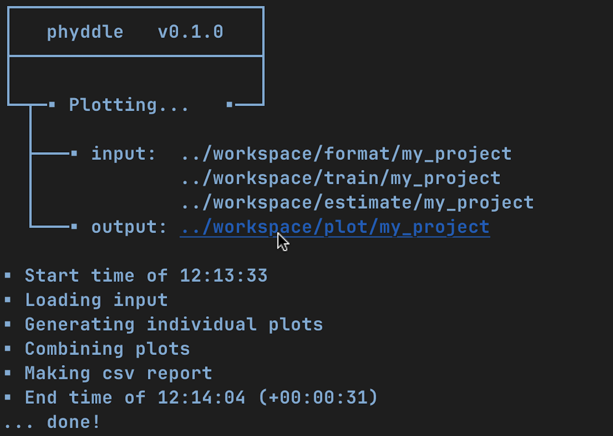

.. _Overview:


Overview
========

.. note:: 
    
    This page describes how a standard phyddle pipeline analysis is
    configured and how settings determine software behavior.
    Main sections: :ref:`Configuration`, :ref:`Pipeline`, :ref:`Workspace`,
    :ref:`Formats`, and :ref:`Safe_Usage`. Visit :ref:`Glossary` to learn
    more about how phyddle defines different terms.

.. image:: images/phyddle_pipeline.png
  :width: 350
  :align: right

A phyddle pipeline analysis has five steps: :ref:`Simulate`, :ref:`Format`,
:ref:`Train`, :ref:`Estimate`, and :ref:`Plot`. Standard analyses run all
steps, in order, based on the analysis :ref:`Configuration`. Steps
can also be run individually and/or multiple times under different
settings and orders, which is useful for exploratory and advanced analyses.

All pipeline steps create output files, which are stored in the
:ref:`Workspace` directories. All pipeline (except :ref:`Simulate`) also
require input files corresponding to at least one other pipeline step.
A full phyddle analysis for a *project* will automatically generate the
input files for downstream pipeline steps and store them in a predictable
*project directory*.

Users may also elect to use phyddle for only some steps in their analysis, and
produce files for other steps by different means. For example, :ref:`Format`
expects to format and combine large numbers of simulated datasets into tensor
formats that can be used for supervised learning with neural networks.
These simulated files can either be generated through phyddle with
the :ref:`Simulate` step or outside of phyddle entirely.

Below is the standard :ref:`Workspace` directory structure that a standard
phyddle project would use. In this section, we assume the project ``dir`` is 
``./workspace/example``:

.. code-block:: shell

    Simulate 
    - input:   None
    - output:  ./workspace/example/simulate  # simulated datasets

    Format
    - input:   ./workspace/example/simulate  # simulated datasets
               ./workspace/example/empirical # empirical datasets
    - output:  ./workspace/example/format    # formatted datasets
  
    Train
    - input:   ./workspace/example/format    # simulated training dataset
    - output:  ./workspace/example/train     # trained network + train results
  
    Estimate
    - input:   ./workspace/example/format    # simulated test + empirical datasets
               ./workspace/example/train     # trained network
    - output:  ./workspace/example/estimate  # test + empirical results

    Plot
    - input:   ./workspace/example/format    # simulated training dataset
               ./workspace/example/train     # trained network and output
               ./workspace/example/estimate  # simulated + empirical estimates
    - output:  ./workspace/example/plot      # analysis figures

.. _Configuration:

Configuration
-------------

There are two ways to configure the settings of a phyddle analysis: through a
:ref:`config file <config_file>` or the :ref:`command line <config_cli>`.
Command line settings take precedence over config file settings. 

.. note::

    The :ref:`Appendix` contains a :ref:`setting_summary` that summarizes all
    available settings.


.. _config_file:

By file
^^^^^^^

The phyddle config file is a Python dictionary of analysis arguments (``args``)
that configure how phyddle pipeline steps behave. Because it's a Python script,
you can write code within the config file to specify your analysis, if you find
that helpful. The below example defines settings into different blocks based on
which pipeline step first needs a given setting. However, any setting might be
used by different pipeline steps, so we concatenate all settings into a single
dictionary called ``args``, which is then used by all pipeline steps. Settings
configured by file can be adjusted through the :ref:`command line <config_cli>`,
if desired.

.. note::

    By default, phyddle assumes you want to use the config file called
    ``config.py``. Use a different config file by calling, e.g.
    ``phyddle --cfg my_other_config.py``

.. note::

    phyddle maintains a number of example config files for different models
    and simulation methods. These are organized as project subdirectories
    within the ``./workspace`` directory. For example,
    ``./workspace/bisse_r/config.py`` simulates under a BiSSE model
    with the R simulation script ``./workspace/bisse_r/sim_bisse.R``.

.. code-block:: python

    #==============================================================================#
    # Config:       Example phyddle config file                                    #
    # Authors:      Michael Landis and Ammon Thompson                              #
    # Date:         230804                                                         #
    # Description:  Simple BiSSE model                                             #
    #==============================================================================#

    args = {
        #-------------------------------#
        # Basic                         #
        #-------------------------------#
        'step'               : 'SFTEP',        # Pipeline step(s) defined with
                                               #   (S)imulate, (F)ormat, (T)rain,
                                               #   (E)stimate, (P)lot, or (A)ll
        'verbose'            : 'T',            # Verbose output to screen?

        #-------------------------------#
        # Analysis                      #
        #-------------------------------#
        'use_parallel'       : 'T',            # Use parallelization? (recommended)
        'num_proc'           : -2,             # Number of cores for multiprocessing 
                                               #   (-N for all but N)
        'use_cuda'           : 'T',            # Use CUDA parallelization?
                                               #   (recommended; requires Nvidia GPU)
                                               
        #-------------------------------#
        # Workspace                     #
        #-------------------------------#
        
        'dir'                : './',           # Base directory for all step directories
        'prefix'             : 'out',                   # Prefix for all output unless step prefix given

        #-------------------------------#
        # Simulate                      #
        #-------------------------------#
        'sim_command'        : f'Rscript ./sim_bisse.R', # Simulation command to run single
                                                                  #   job (see documentation)
        'sim_logging'        : 'verbose',                 # Simulation logging style
        'start_idx'          : 0,                         # Start index for simulated training replicates
        'end_idx'            : 1000,                      # End index for simulated training replicates
        'sim_batch_size'     : 10,                        # Number of replicates per simulation command

        #-------------------------------#
        # Format                        #
        #-------------------------------#
        'encode_all_sim'     : 'T',                  # Encode all simulated replicates into tensor?
        'num_char'           : 1,                    # Number of characters
        'num_states'         : 2,                    # Number of states per character
        'min_num_taxa'       : 10,                   # Minimum number of taxa allowed when formatting
        'max_num_taxa'       : 500,                  # Maximum number of taxa allowed when formatting
        'downsample_taxa'    : 'uniform',            # Downsampling strategy taxon count
        'tree_width'         : 500,                  # Width of phylo-state tensor
        'tree_encode'        : 'extant',             # Encoding strategy for tree
        'brlen_encode'       : 'height_brlen',       # Encoding strategy for branch lengths
        'char_encode'        : 'integer',            # Encoding strategy for character data
        'param_est'          : {                     # Unknown model parameters to estimate
            'log10_birth_1'      : 'num',
            'log10_birth_2'      : 'num',
            'log10_death'        : 'num',
            'log10_state_rate'   : 'num',
            'model_type'         : 'cat',
            'root_state'         : 'cat'
        ],
        'param_data'        : {                      # Known model parameters to treat as aux. data
            'sample_frac'        : 'num'
        },
        'char_format'        : 'csv',                # File format for character data
        'tensor_format'      : 'hdf5',               # File format for training example tensors

        #-------------------------------#
        # Train                         #
        #-------------------------------#
        'num_epochs'         : 20,                   # Number of training epochs
        'trn_batch_size'     : 2048,                 # Training batch sizes
        'prop_test'          : 0.05,                 # Proportion of data used as test examples
                                                     #     (to assess trained network performance)
        'prop_val'           : 0.05,                 # Proportion of data used as validation examples
                                                     #     (to diagnose network overtraining)
        'prop_cal'           : 0.2,                  # Proportion of data used as calibration examples
                                                     #     (to calibrate CPIs)
        'cpi_coverage'       : 0.95,                 # Expected coverage percent for calibrated
                                                     #     prediction intervals (CPIs)
        'cpi_asymmetric'     : 'T',                  # Use asymmetric (True) or symmetric (False)
                                                     #     adjustments for CPIs?
        'loss'               : 'mae',                # Loss function for optimization
        'optimizer'          : 'adam',               # Method used for optimizing neural network
        'phy_channel_plain'  : [64, 96, 128],        # Output channel sizes for plain convolutional
                                                     #     layers for phylogenetic state input
        'phy_channel_stride' : [64, 96],             # Output channel sizes for stride convolutional
                                                     #     layers for phylogenetic state input
        'phy_channel_dilate' : [32, 64],             # Output channel sizes for dilate convolutional
                                                     #     layers for phylogenetic state input
        'aux_channel'        : [128, 64, 32],        # Output channel sizes for dense layers for
                                                     #     auxiliary data input
        'lbl_channel'        : [128, 64, 32],        # Output channel sizes for dense layers for
                                                     #     label outputs
        'phy_kernel_plain'   : [3, 5, 7],            # Kernel sizes for plain convolutional layers
                                                     #     for phylogenetic state input
        'phy_kernel_stride'  : [7, 9],               # Kernel sizes for stride convolutional layers
                                                     #     for phylogenetic state input
        'phy_kernel_dilate'  : [3, 5],               # Kernel sizes for dilate convolutional layers
                                                     #     for phylogenetic state input
        'phy_stride_stride'  : [3, 6],               # Stride sizes for stride convolutional layers
                                                     #     for phylogenetic state input
        'phy_dilate_dilate'  : [3, 5],               # Dilation sizes for dilate convolutional layers
                                                     #     for phylogenetic state input

        #-------------------------------#
        # Estimate                      #
        #-------------------------------#
        # not currently used

        #-------------------------------#
        # Plot                          #
        #-------------------------------#
        'plot_train_color'   : 'blue',               # Plotting color for training data elements
        'plot_label_color'   : 'orange',             # Plotting color for training label elements
        'plot_test_color'    : 'purple',             # Plotting color for test data elements
        'plot_val_color'     : 'red',                # Plotting color for validation data elements
        'plot_aux_color'     : 'green',              # Plotting color for auxiliary data elements
        'plot_emp_color'     : 'black',              # Plotting color for empirical elements
        'plot_num_scatter'   : 50,                   # Number of examples in scatter plot
        'plot_min_emp'       : 5,                    # Minimum number of empirical datasets to plot densities
        'plot_num_emp'       : 10                    # Number of empirical results to plot
       }

.. _config_CLI:

Via command line
^^^^^^^^^^^^^^^^

Settings applied through a :ref:`config file <config_file>` can be overwritten
by setting options when running phyddle from the command line. The names of
settings are the same for the command line options and in the config file.
Using command line options makes it easy to adjust the behavior of pipeline
steps without needing to edit the config file. List all settings that can be
adjusted with the command line using the ``--help`` option:

.. code-block::

	usage: phyddle [-h] [-c] [-s] [-v] [--make_cfg ] [--save_proj ] [--load_proj ]
               [--clean_proj ] [--save_num_sim] [--save_train_fmt]
               [--output_precision] [--use_parallel] [--use_cuda] [--num_proc]
               [--no_emp] [--no_sim] [--dir] [--sim_dir] [--emp_dir]
               [--fmt_dir] [--trn_dir] [--est_dir] [--plt_dir] [--log_dir]
               [--prefix] [--sim_prefix] [--emp_prefix] [--fmt_prefix]
               [--trn_prefix] [--est_prefix] [--plt_prefix] [--sim_command]
               [--sim_logging {clean,compress,verbose}] [--start_idx]
               [--end_idx] [--sim_more] [--sim_batch_size] [--encode_all_sim]
               [--num_char] [--num_states] [--min_num_taxa] [--max_num_taxa]
               [--downsample_taxa {uniform}] [--tree_width]
               [--tree_encode {extant,serial}]
               [--brlen_encode {height_only,height_brlen}]
               [--char_encode {one_hot,integer,numeric}] [--param_est]
               [--param_data] [--char_format {csv,nexus}]
               [--tensor_format {csv,hdf5}] [--save_phyenc_csv] [--num_epochs]
               [--num_early_stop] [--trn_batch_size] [--prop_test]
               [--prop_val] [--prop_cal] [--cpi_coverage] [--cpi_asymmetric]
               [--loss_numerical {mse,mae}] [--optimizer {adam}]
               [--log_offset] [--phy_channel_plain] [--phy_channel_stride]
               [--phy_channel_dilate] [--aux_channel] [--lbl_channel]
               [--phy_kernel_plain] [--phy_kernel_stride]
               [--phy_kernel_dilate] [--phy_stride_stride]
               [--phy_dilate_dilate] [--plot_train_color] [--plot_test_color]
               [--plot_val_color] [--plot_label_color] [--plot_aux_color]
               [--plot_emp_color] [--plot_num_scatter] [--plot_min_emp]
               [--plot_num_emp] [--plot_pca_noise]

    Software to fiddle around with deep learning for phylogenetic models
    
    options:
      -h, --help            show this help message and exit
      -c, --cfg             Config file name
      -s, --step            Pipeline step(s) defined with (S)imulate, (F)ormat,
                            (T)rain, (E)stimate, (P)lot, or (A)ll
      -v, --verbose         Verbose output to screen?
      --make_cfg            Write default config file
      --save_proj           Save and zip a project for sharing
      --load_proj           Unzip a shared project
      --clean_proj          Remove step directories for a project
      --save_num_sim        Number of simulated examples to save with --save_proj
      --save_train_fmt      Save formatted training examples with --save_proj?
                            (not recommended)
      --output_precision    Number of digits (precision) for numbers in output
                            files
      --use_parallel        Use parallelization? (recommended)
      --use_cuda            Use CUDA parallelization? (recommended; requires
                            Nvidia GPU)
      --num_proc            Number of cores for multiprocessing (-N for all but N)
      --no_emp              Disable Format/Estimate steps for empirical data?
      --no_sim              Disable Format/Estimate steps for simulated data?
      --dir                 Parent directory for all step directories unless step
                            directory given
      --sim_dir             Directory for raw simulated data
      --emp_dir             Directory for raw empirical data
      --fmt_dir             Directory for tensor-formatted data
      --trn_dir             Directory for trained networks and training output
      --est_dir             Directory for new datasets and estimates
      --plt_dir             Directory for plotted results
      --log_dir             Directory for logs of analysis metadata
      --prefix              Prefix for all output unless step prefix given
      --sim_prefix          Prefix for raw simulated data
      --emp_prefix          Prefix for raw empirical data
      --fmt_prefix          Prefix for tensor-formatted data
      --trn_prefix          Prefix for trained networks and training output
      --est_prefix          Prefix for estimate results
      --plt_prefix          Prefix for plotted results
      --sim_command         Simulation command to run single job (see documentation)
      --sim_logging {clean,compress,verbose}
                            Simulation logging style
      --start_idx           Start replicate index for simulated training dataset
      --end_idx             End replicate index for simulated training dataset
      --sim_more            Add more simulations with auto-generated indices
      --sim_batch_size      Number of replicates per simulation command
      --encode_all_sim      Encode all simulated replicates into tensor?
      --num_char            Number of characters
      --num_states          Number of states per character
      --min_num_taxa        Minimum number of taxa allowed when formatting
      --max_num_taxa        Maximum number of taxa allowed when formatting
      --downsample_taxa {uniform}
                            Downsampling strategy taxon count
      --tree_width          Width of phylo-state tensor
      --tree_encode {extant,serial}
                            Encoding strategy for tree
      --brlen_encode {height_only,height_brlen}
                            Encoding strategy for branch lengths
      --char_encode {one_hot,integer,numeric}
                            Encoding strategy for character data
      --param_est           Model parameters and variables to estimate
      --param_data          Model parameters and variables treated as data
      --char_format {csv,nexus}
                            File format for character data
      --tensor_format {csv,hdf5}
                            File format for training example tensors
      --save_phyenc_csv     Save encoded phylogenetic tensor encoding to csv?
      --num_epochs          Number of training epochs
      --num_early_stop      Number of consecutive validation loss gains before
                            early stopping
      --trn_batch_size      Training batch sizes
      --prop_test           Proportion of data used as test examples (assess
                            trained network performance)
      --prop_val            Proportion of data used as validation examples
                            (diagnose network overtraining)
      --prop_cal            Proportion of data used as calibration examples
                            (calibrate CPIs)
      --cpi_coverage        Expected coverage percent for calibrated prediction
                            intervals (CPIs)
      --cpi_asymmetric      Use asymmetric (True) or symmetric (False) adjustments
                            for CPIs?
      --loss_numerical {mse,mae}
                            Loss function for real value estimates
      --optimizer {adam}    Method used for optimizing neural network
      --log_offset          Offset size c when taking ln(x+c) for zero-valued
                            variables
      --phy_channel_plain   Output channel sizes for plain convolutional layers
                            for phylogenetic state input
      --phy_channel_stride
                            Output channel sizes for stride convolutional layers
                            for phylogenetic state input
      --phy_channel_dilate
                            Output channel sizes for dilate convolutional layers
                            for phylogenetic state input
      --aux_channel         Output channel sizes for dense layers for auxiliary
                            data input
      --lbl_channel         Output channel sizes for dense layers for label
                            outputs
      --phy_kernel_plain    Kernel sizes for plain convolutional layers for
                            phylogenetic state input
      --phy_kernel_stride   Kernel sizes for stride convolutional layers for
                            phylogenetic state input
      --phy_kernel_dilate   Kernel sizes for dilate convolutional layers for
                            phylogenetic state input
      --phy_stride_stride   Stride sizes for stride convolutional layers for
                            phylogenetic state input
      --phy_dilate_dilate   Dilation sizes for dilate convolutional layers for
                            phylogenetic state input
      --plot_train_color    Plotting color for training data elements
      --plot_test_color     Plotting color for test data elements
      --plot_val_color      Plotting color for validation data elements
      --plot_label_color    Plotting color for label elements
      --plot_aux_color      Plotting color for auxiliary data elements
      --plot_emp_color      Plotting color for empirical elements
      --plot_num_scatter    Number of examples in scatter plot
      --plot_min_emp        Minimum number of empirical datasets to plot densities
      --plot_num_emp        Number of empirical results to plot
      --plot_pca_noise      Scale of Gaussian noise to add to PCA plot


Note: the ``step`` setting controls which steps should be applied.
Each pipeline step is represented by a capital letter:
``S`` for :ref:`Simulate`, ``F`` for :ref:`Format`, ``T`` for :ref:`Train`,
``E`` for :ref:`Estimate`, ``P`` for :ref:`Plot`, and ``A`` for all steps.

For example, the following two commands are equivalent

.. code-block:: shell

    phyddle --step A
    phyddle -s SFTEP

whereas calling

.. code-block:: shell

    phyddle -s SF

commands phyddle to perform the *Simulate* and *Format* steps, but not the *Train*,
*Estimate*, and *Plot* steps.


.. _Pipeline:

Pipeline
--------

A standard phyddle analysis runs five steps -- *Simulate*, *Format*, *Train*,
*Estimate*, and *Plot* -- in order.

.. _setting_description_dir:

Step directories
^^^^^^^^^^^^^^^^

In general, each phyddle analysis will store all work within a single
project directory. Work from each step, however, is stored into different
subdirectories.

Customizing the input and output directories among steps allows users to
quickly explore alternative pipeline designs while leaving previous
pipeline results in place.

The project directory can be set using ``dir``. During analysis, phyddle will
create subdirectories for each step using default names, as needed. For example,
if ``dir`` is set to the local directory ``./``, then a full phyddle analysis 
would use the following directories for the analysis:

.. code-block:: shell

  ./simulate        # default sim_dir
  ./empirical       # default emp_dir
  ./format          # default fmt_dir
  ./train           # default trn_dir
  ./estimate        # default est_dir
  ./plot            # default plt_dir
  ./log             # default log_dir

Individual step directories can be overriden with custom directory locations.
For example, setting ``dir`` to ``./`` but setting ``emp_dir`` to
``/Users/mlandis/datasets/viburnum`` and ``plt_dir`` to 
``/Users/mlandis/projects/viburnum/results`` would cause
phyddle to use the following directories:
 
.. code-block:: shell
    
  ./simulate                                # default sim_dir
  /Users/mlandis/datasets/viburnum          # custom emp_dir
  ./format                                  # default fmt_dir
  ./train                                   # default trn_dir
  ./estimate                                # default est_dir
  /Users/mlandis/projects/viburnum/results  # custom plt_dir
  ./log                                     # default log_dir 
 

.. _setting_description_prefix:

Step prefixes
^^^^^^^^^^^^^

Standard phyddle analyses assume that the files generated by each pipeline
step begin with the filename prefix ``'out'``.

The filename prefix for all pipeline steps can be changed using the ``prefix``
settings. Changing the filename prefix allows you to generate alternative
pipeline filesets without overwriting previous results.

As with the pipeline directory settings (above), prefixes for individual
pipeline steps can be overridden with custom prefixes. This allows you to compare
pipeline performance using different settings, while saving previous work. For
example,

.. code-block:: shell

  phyddle -c config.py \                # load config
          -s TE \                       # run Train and Estimate steps
          --prefix new \                # T & E output has prefix 'new'
          --fmt_prefix out \            # Format input has prefix 'out' 
          --num_epochs 50 \             # Train for 50 epochs
          --trn_batch_size 4096         # Use batch sizes of 4096 samples


By default the :ref:`Format` and :ref:`Estimate` steps run in a greedy manner,
against the simulated datasets identified by ``dir`` (or ``sim_dir``) and
``prefix`` (or ``sim_prefix``), and against the empirical datasets identified
by ``dir`` (or ``emp_dir``) and ``prefix`` (or ``emp_prefix``), should those
datasets exist.

Setting ``--no_sim`` during a command-line run will instruct phyddle to skip
the Format and Estimate steps for the simulated datasets (i.e. the train and
test datasets).

Setting ``--no_emp`` during a command-line run will instruct phyddle to skip
the Format and Estimate steps for the empirical datasets.
 
In particular, the ``--no_sim`` flag in particular is useful when you only
need to format new empirical datasets, but do not need to reformat existing
simulated (i.e. training/test) datasets. The flag helps eliminate redundant
formatting tasks during pipeline development. 


.. _Simulate:

Simulate
^^^^^^^^

:ref:`Simulate` instructs phyddle to simulate your training dataset. Any
simulator that can be called from command-line can be used to generate training
datasets with phyddle. This allows researchers to use their favorite simulator
with phyddle for phylogenetic modeling tasks.

As a worked example, suppose we have an R script called ``sim_bisse.R`` containing
the following code

.. code-block:: r

    #!/usr/bin/env Rscript
    library(castor)
    library(ape)

    # disable warnings
    options(warn = -1)

    # example command string to simulate for "sim.1" through "sim.10"
    # cd ~/projects/phyddle/workspace/example
    # Rscript sim_bisse.R ./simulate example 1 10

    # arguments
    args        = commandArgs(trailingOnly = TRUE)
    out_path    = args[1]
    out_prefix  = args[2]
    start_idx   = as.numeric(args[3])
    batch_size  = as.numeric(args[4])
    rep_idx     = start_idx:(start_idx+batch_size-1)
    num_rep     = length(rep_idx)
    get_mle     = FALSE

    # filesystem
    tmp_fn = paste0(out_path, "/", out_prefix, ".", rep_idx)  # sim path prefix
    phy_fn = paste0(tmp_fn, ".tre")               # newick file
    dat_fn = paste0(tmp_fn, ".dat.csv")           # csv of data
    lbl_fn = paste0(tmp_fn, ".labels.csv")        # csv of labels (e.g. params)

    # dataset setup
    num_states = 2
    tree_width = 500
    label_names = c(paste0("log10_birth_",1:num_states),
                    "log10_death", "log10_state_rate", "sample_frac")

    # simulate each replicate
    for (i in 1:num_rep) {

        # set RNG seed
        set.seed(rep_idx[i])

        # rejection sample
        num_taxa = 0
        while (num_taxa < 10) {

            # simulation conditions
            max_taxa = runif(1, 10, 5000)
            max_time = runif(1, 1, 100)
            sample_frac = 1.0
            if (max_taxa > tree_width) {
                sample_frac = tree_width / max_taxa
            }

            # simulate parameters
            Q = get_random_mk_transition_matrix(num_states, rate_model="ER",
                                                max_rate=0.1)
            birth = runif(num_states, 0, 1)
            death = min(birth) * runif(1, 0, 1.0)
            death = rep(death, num_states)
            parameters = list(
                birth_rates=birth,
                death_rates=death,
                transition_matrix_A=Q
            )

            # simulate tree/data
            res_sim = simulate_dsse(
                    Nstates=num_states,
                    parameters=parameters,
                    sampling_fractions=sample_frac,
                    max_extant_tips=max_taxa,
                    max_time=max_time,
                    include_labels=T,
                    no_full_extinction=T)

            # check if tree is valid
            num_taxa = length(res_sim$tree$tip.label)
        }

        # save tree
        tree_sim = res_sim$tree
        write.tree(tree_sim, file=phy_fn[i])

        # save data
        state_sim = res_sim$tip_states - 1
        df_state = data.frame(taxa=tree_sim$tip.label, data=state_sim)
        write.csv(df_state, file=dat_fn[i], row.names=F, quote=F)

        # save learned labels (e.g. estimated data-generating parameters)
        label_sim = c(birth[1], birth[2], death[1], Q[1,2], sample_frac)
        label_sim = log(label_sim, base=10)
        names(label_sim) = label_names
        df_label = data.frame(t(label_sim))
        write.csv(df_label, file=lbl_fn[i], row.names=F, quote=F)

    }


    # done!
    quit()
  

This particular script has a few important features. First, the simulator is
entirely responsible for simulating the dataset. Second, the script assumes it
will be provided runtime arguments (``args```) to generate filenames and to
determine how many simulated datasets will be generated when the script is run
(more details in next paragraph). Third, output for the Newick string is stored
into a ``.tre`` file, for the character matrix data into a ``.dat.csv`` file,
and for the training labels into a comma-separated ``.csv`` file.

Now that we understand the script, we need to configure phyddle to call it
properly. This is done by setting the ``sim_command`` argument equal to a
command string of the form ``MY_COMMAND [MY_COMMAND_ARGUMENTS]``. During
simulation, phyddle executes the command string against different filepath
locations. More specifically, phyddle will execute the command
``MY_COMMAND [MY_COMMAND_ARGUMENTS] [SIM_DIR] [SIM_PREFIX]``, where ``SIM_DIR``
is the path to the directory locating the individual simulated datasets, and 
``SIM_PREFIX`` is a common prefix shared by individual simulation files. As
part of the Simulate step, phyddle will execute the command string to generate
the complete simulated dataset of replicated training examples.

In this case, we assume that `sim_bisse.R` is an R script that is located in
the same directory as `config.py` and can be executed using the `Rscript` 
command. The correct `sim_command` value to run this script is:

.. code-block:: python

    'sim_command' : 'Rscript ./sim_bisse.R'

Assuming ``sim_dir = './simulate'``, ``sim_prefix = 'sim'``
``sim_batch_size = 10``, phyddle will execute the commands during simulation

.. code-block:: shell

    Rscript sim_one.R ./simulate/ sim 0 10
    Rscript sim_one.R ./simulate/ sim 10 10
    Rscript sim_one.R ./simulate/ sim 20 10
    ...

for every replication index between ``start_idx`` and ``end_idx`` in
increments of ``sim_batch_size``, where the R script itself is responsible
for generating the ``sim_batch_size`` replicates per batch. In fact,
executing ``Rscript sim_bisse.R ./simulate/ sim 1 10``
from terminal is an ideal way to validate that your custom simulator is
compatible with the phyddle requirements.


.. _Format:

Format
^^^^^^

:ref:`Format` converts simulated and/or empirical data for a project into a
tensor format that phyddle uses to train neural networks in the :ref:`Train`
step. :ref:`Format` performs two main tasks:

1. Encode all individual raw datasets in the simulate and empirical project
   directory into individual tensor representations
2. Combines all the individual tensors into larger, singular tensors that can
   be processed by the neural network

For each example, :ref:`Format` encodes the raw data into two input
tensors and one output tensor:

- One input tensor is the **phylogenetic-state tensor**. Loosely speaking,
  these tensors contain information associated with clades across rows and
  information about relevant branch lengths and states per taxon across columns.
  The phylogenetic-state tensors used by phyddle are based on the compact
  bijective ladderized vector (**CBLV**) format of Voznica et al. (2022) and
  the compact diversity-reordered vector (**CDV**) format of
  Lambert et al. (2022) that incorporates tip states (**CBLV+S** and **CDV+S**)
  using the technique described in Thompson et al. (2022).
- The second input is the **auxiliary data tensor**. This tensor contains
  summary statistics for the phylogeny and character data matrix and "known"
  parameters for the data generating process.
- The output tensor reports **labels** that are generally unknown data
  generating parameters to be estimated using the neural network. Depending on
  the estimation task, all or only some model parameters might be treated as
  labels for training and estimation.

For most purposes within phyddle, it is safe to think of a tensor as an
n-dimensional array, such as a 1-d vector or a 2-d matrix. The tensor encoding
ensures training examples share a standard shape (e.g. numbers of rows and
columns) that helps the neural network to detect predictable data patterns.
Learn more about the formats of phyddle tensors on the
:ref:`Tensor Formats <Tensor_Formats>` page.

During tensor-encoding, :ref:`Format` processes the tree, data matrix, and
model parameters for each replicate. This is done in parallel, when the setting
``use_parallel`` is set to ``True``. Simulated data are processed using CBLV+S
format if ``tree_encode`` is set to ``'serial'``. If ``tree_encode`` is set to
``'extant'`` then all non-extant taxa are pruned, saved as ``pruned.tre``, then
encoded using CDV+S. Standard CBLV+S and CDV+S formats are used when
``brlen_encode`` is ``'height_only'``, while additional branch length
information is added as rows when ``brlen_encode`` is set to
``'height_brlen'``. Each tree is then encoded into a phylogenetic-state tensor
with a maximum of ``tree_width`` sampled taxa. Trees that contain more taxa are
downsampled to ``tree_width`` taxa. The number of taxa in each original dataset
is recorded in the summary statistics, allowing the trained network to 
make estimates on trees that are larger or smaller than th exact ``tree_width``
size. 

The phylogenetic-state tensors and auxiliary data tensors are then created. If
``save_phyenc_csv`` is set, then individual csv files are saved for each
dataset, which is especially useful for formatting new empirical datasets into
an accepted phyddle format.

The ``param_est`` setting identifies which "unknown"
parameters in the labels tensor you want to treat as downstream estimation
targets. The ``param_data`` setting identifies which of those parameters you
want to treat as "known" auxiliary data.

.. code-block:: python

    # Settings in config.py

    # "unknown" parameters to estimate
    'param_est' : {
        'log10_birth_rate' : 'num',
        'log10_death_rate' : 'num',
        'log10_transition_matrix' : 'num',
        'model_type' : 'cat',
        'root_state' : 'cat'
    }
    
    # "known" parameters to use as auxiliary data
    'param_data' : {
        'sample_frac' : 'num'
    }
  
Information for ``param_est`` and ``param_data`` are each stored as dictionaries.
The keys are the names of the parameters (labels) generated by the :ref:`Simulate`
step. The values are the data types of the parameters. Data types may be either
``'num'`` for numerical parameters, or ``'cat'`` for categorical parameters. 

.. note::

    Numerical parameters have ordered values that are negative, positive,
    or zero. We recommend that you transform bounded numerical parameters into
    unbounded values for use with phyddle. For example, although an evolutionary
    rate parameter is non-negative, the log of that rate can be negative,
    positive, or zero.
    
.. note::

    Categorical parameters have unordered values. They are encoded using 
    base-0 sequential integers. For example, the nucleotides for an ancestral
    state estimation task would use ``0, 1, 2, 3`` to represent A, C, G, T.

Lastly, Format creates a test dataset containing proportion ``test_prop`` of
all simulated examples, and a second training dataset that contains all
remaining ``1.0 - test_prop`` examples.

Formatted tensors are then saved to disk either in simple comma-separated
value format or in a compressed HDF5 format. For example, suppose we set
``fmt_dir`` to ``'./format'``, ``fmt_prefix`` to ``'out'``,
and ``tree_encode`` to ``'serial'``. If we set ``tensor_format == 'hdf5'``,
it produces:

.. code-block:: shell

    ./format/out.empirical.hdf5
    ./format/out.test.hdf5
    ./format/out.train.hdf5

or if ``tensor_format == 'csv'``:

.. code-block:: shell

    ./format/out.empirical.aux_data.csv
    ./format/out.empirical.labels.csv
    ./format/out.empirical.phy_data.csv
    ./format/out.test.aux_data.csv
    ./format/out.test.labels.csv
    ./format/out.test.phy_data.csv
    ./format/out.train.aux_data.csv
    ./format/out.train.labels.csv
    ./format/out.train.phy_data.csv

:ref:`Format` behaves the same way for simulated vs. empirical datasets,
except in two key ways. First, simulated datasets will be split into datasets
used to train the neural network and test its accuracy (in proportions defined
by ``test_prop``), whereas empirical datasets are left whole. Second, simulated
datasets will contain labels for all data-generating parameters, meaning both 
the "unknown" parameters that we want to estimate and the "known" parameters
that contribute to the data-generating process, but could be measured in the 
real world. For example, the birth rate might be an "unknown" parameter we want 
to estimate, while the missing proportion of species is a "known" parameter 
that we can provide the network if we know e.g. only 10% of described
plant species are in the dataset.

When searching for empirical and simulated datasets, :ref:`Format` uses
``emp_dir`` and ``sim_dir`` to locate the datasets. The ``emp_prefix`` and
``sim_prefix`` settings are used to identify the datasets. :ref:`Format`
assumes that empirical datasets follow the naming pattern of
``<prefix>.<rep_idx>.<ext>`` described for :ref:`Simulate`. For example,
setting ``emp_dir`` to ``'../dnds/empirical'`` and ``emp_prefix``
to ``'mammal_gene'`` will cause :ref:`Format` to search for files with
these names:

.. code-block:: shell

    ../dnds/empirical/mammal_gene.1.tre
    ../dnds/empirical/mammal_gene.1.dat.csv
    ../dnds/empirical/mammal_gene.1.labels.csv  # if using known params
    ../dnds/empirical/mammal_gene.2.tre
    ../dnds/empirical/mammal_gene.2.dat.csv
    ../dnds/empirical/mammal_gene.2.labels.csv  # if using known params
    ...

Using the ``--no_emp`` or ``--no_sim`` flags will instruct :ref:`Format` to
skip processing the empirical and simulated datasets, respectively. In
addition, :ref:`Format` will report that it is skipping the empirical and
simulated datasets if they do not exist.

Once complete, the formatted files can then be processed by the
:ref:`Train` step and :ref:`Estimate` steps.


.. _Train:

Train
^^^^^

:ref:`Train` builds a neural network and trains it to make model-based
estimates using the simulated training example tensors compiled by the
:ref:`Format` step.

The :ref:`Train` step performs six main tasks:

1. Load the input training example tensor.
2. Shuffle the input tensor and split it into training, test, validation, and calibration subsets.
3. Build and configure the neural network
4. Use supervised learning to train neural network to make accurate estimates (predictions)
5. Record network training performance to file
6. Save the trained network to file

Each network is trained for one set of prediction tasks for the exact model
as specified for the :ref:`Simulate` step. Each network is trained to
expect a specific set of :ref:`Format` settings (see above).
Important :ref:`Format` settings include ``tree_width``, ``num_char``,
``num_states``, ``char_encode``, ``tree_encode``, ``brlen_encode``,
``param_est``, and ``param_known``. 

When the training dataset is read in, its examples are randomly shuffled by
replicate index. It then sets aside some examples for a validation dataset
(``prop_val``) and others for a calibration dataset (``prop_cal``). Note, 
the :ref:`Format` step will have previously set aside some proportion of test 
number of examples (``prop_test``) to measure final network accuracy
during the later :ref:`Estimate` step. The ``prop_val`` and ``prop_cal``
are themselves proportions of the ``1.0 - prop_test`` training example
proportion.

phyddle uses `PyTorch <https://pytorch.org/>` to build and train the network.
The phylogenetic-state tensor is processed by convolutional and pooling layers,
while the auxiliary data is processed by dense layers. All input layers are
concatenated then pushed into three branches terminating in output layers
to produce point estimates and upper and lower estimation intervals. Here
is a simplified schematic of the network architecture:

.. code-block::

    Simplified network architecture:
                              
                         Phylo. Data                  Aux. Data
                            Input                       Input
                              |                           |
                .-------------+-------------.             |
               v              v              v            v
        Conv1D-plain   Conv1D-dilate   Conv1D-stride    Dense
           + Pool         + Pool          + Pool          |
               .              |              |            |
                `-------------+----+---------+-----------'
                                   |
                                   v
                                 Concat
                                + Dense
                                   |     
                .-----------+------+-----+-----------.
               v            v            v            v
             Lower        Point        Upper        Categ.
            quantile     estimate     quantile    estimates


The number of layers (depth) and nodes (width) can be controlled through the
``phy_channel_plain``, ``phy_channel_stride``, ``phy_channel_dilate``,
``aux_channel``, and ``lbl_channel`` settings. For example, the default
value for ``lbl_channel`` is ``[128, 64, 32],``, which creates three dense
layers with 128, 64, and 32 output channels, in that order. The default value
for ``phy_channel_plain`` is ``[64, 96, 128]``, which creates three
sets of convolutional and average-pooling layers with 64, 96, and 128
output channels. Stride, dilation, and sizes for convolutional kernels can
be adjusted using ``phy_kernel_plain``, ``phy_kernel_stride``,
``phy_kernel_dilate``, ``phy_stride_stride``, and ``phy_dilate_dilate``.

Parameter point estimates use a loss function (e.g. ``loss_numerical``
set to ``'mse'``). Lower and upper quantile estimates for numerical labels
are hard-coded to use a pinball loss function. Categorical label estimates are
hard-coded to use the cross-entropy loss function (one per cat. label).
Most layers share the the activation function defined by ``activation_func``,
which uses  rectified linear units (ReLUs) by default. The output channels
for each categorical variable uses a softmax activation function.

Calibrated prediction intervals (CPIs) are estimated using the conformalized
quantile regression technique of Romano et al. (2019). CPIs target a
particular estimation interval, e.g. set ``cpi_coverage`` to ``0.80`` so
80% of test estimations are expected contain the true simulating value.
More accurate CPIs can be obtained using two-sided conformalized quantile
regression by setting ``cpi_asymmetric`` to ``True``, though this often
requires larger numbers of calibration examples, determined through
``prop_cal``. 

The network is trained iteratively for ``num_epoch`` training cycles using
batch stochastic gradient descent, with batch sizes given by ``trn_batch_size``.
Different optimizers can be used to update network weight and bias
parameters (e.g. ``optimizer == 'adam'``). The initial learning rate can be
adjusted with ``learning_rate``. Network performance is also
evaluated against a validation dataset, which contains ``prop_val`` of
all training examples, and not used for minimizing the loss function.
To prevent overtraining, phyddle will terminate training if the validation
loss does not improve for ``num_early_stop`` consecutive epochs (see
:ref:`Safe_Usage`).


Training is automatically parallelized using CPUs and GPUs, dependent on
how Tensorflow was installed and system hardware. Output files are stored
in the directory assigned to ``trn_dir``.


.. _Estimate:

Estimate
^^^^^^^^

:ref:`Estimate` loads the simulated and empirical test datasets created by
:ref:`Format` stored in ``fmt_dir`` with prefix ``fmt_prefix``. For example,
if ``fmt_dir == './format'``, ``fmt_prefix == 'out'``,
and ``tensor_format == 'hdf5'`` then :ref:`Estimate` will process the
following files, if they exist: 

.. code-block:: shell

    ./out.test.hdf5
    ./out.empirical.hdf5

This step then loads a pretrained network for a given ``tree_width`` and
uses it to estimate parameter values and calibrated prediction intervals
(CPIs) for both the empirical dataset and the (simulated) test dataset.
Estimates are then stored as separate files into the ``est_dir`` directory.

Using the ``--no_emp`` or ``--no_sim`` flags will instruct :ref:`Estimate` to
skip processing the empirical and simulated datasets, respectively. In
addition, :ref:`Estimate` will report that it is skipping the empirical and
simulated datasets if they do not exist.

When :ref:`Estimate` is involves empirical data, the step will report
any input datasets our output estimates that have unusually extreme
values relative to the training dataset. This is useful for identifying
out-of-distribution errors (see :ref:`Safe_Usage`).


.. _Plot:

Plot
^^^^

:ref:`Plot` collects all results from the :ref:`Format`, :ref:`Train`, and
:ref:`Estimate` steps to compile a set of useful figures, listed below. When 
results from :ref:`Estimate` are available, the step will integrate it into
other figures to contextualize where that input dataset and estimated
labels fall with respect to the training dataset.

Importantly, Plot will report instances where training, test, and empirical
input datasets and output estimates are unusually different. This informs
users of poor network behavior (see :ref:`Safe_Usage`).

Plots are stored within ``plot_dir``.
Colors for plot elements can be modified with ``plot_train_color``,
``plot_label_color``, ``plot_test_color``, ``plot_val_color``,
``plot_aux_color``, and ``plot_est_color`` using hex codes or common color
names supported by `Matplotlib <https://matplotlib.org/stable/gallery/color/named_colors.html>`__.

- ``summary.pdf`` contains all figures in a single plot
- ``summary.csv`` records important results in plain text format
- ``density_<dataset_name>_aux_data.pdf`` - densities of all values in the auxiliary dataset;
  red line for empirical dataset; run for training and empirical datasets
- ``density_<dataset_name>_label.pdf`` - densities of all values in the auxiliary dataset;
  red line for empirical dataset; run for training and empirical datasets
- ``pca_<dataset_name>_aux_data.pdf`` - pairwise PCA of all values in the auxiliary dataset;
  red dot for empirical dataset; run for training and empirical datasets
- ``pca_<dataset_name>_label.pdf`` - pairwise PCA of all values in the auxiliary dataset;
  red dot for empirical dataset; run for training and empirical datasets
- ``train_history.pdf`` - loss performance across epochs for test/validation
  datasets for entire network
- ``<dataset_name>_estimate_<num_label_name>.pdf`` - point estimates and calibrated
  estimation intervals of numerical parameters for test or training datasets
- ``<dataset_name>_estimate_<cat_label_name>.pdf`` - confusion matrix of categorical
  parameters for test or training dataset
- ``empirical_estimate_num_<N>.pdf`` - simple plot of point estimates and
  calibrated prediction intervals for each empirical dataset
- ``empirical_estimate_cat_<N>.pdf`` - simple bar plot for each empirical dataset
- ``network_architecture.pdf`` - visualization of Tensorflow architecture

The :ref:`Tutorial` and :ref:`Safe_Usage` pages display examples of figures
and explain how to interpret them.

.. _Workspace:

Workspace
---------

This section describes how phyddle organizes files and directories in its
workspace.

.. note:: 
    
    We strongly recommend that beginning users follow this general workspace
    filesystem design. Advanced users should find it is easy to customize
    locations for config files, simulation scripts, and output directories.

We recommend using the default directory structure for new projects
to simplify project management. By default, ``dir`` is set to ``./`` and
``prefix`` is set to ``out``. Output for each step is then stored in a
subdirectory named after the step and beginning with the appropriate prefix.

For example, results from :ref:`Simulate` are stored in the
``simulate`` subdirectory of the ``dir``` directory. If the ``sim_dir`` 
setting is provided, :ref:`Simulate` results are stored into that exact
directory. For example, if ``dir`` is set to the local directory ``./``,
then :ref:`Simulate` results are saved to ``./simulate``. If ``sim_dir`` is
set to ``../new_project/new_simulations`` then :ref:`Simulate` results are
stored there regardless of the ``dir`` setting.

Similarly, if ``prefix`` is set to ``out``, then all
simulated datasets begin with the prefix ``out``. If the setting ``sim_prefix``
is set to ``sim``, then files generated by :ref:`Simulate` begin with the
prefix ``sim``.

Briefly, the ``workspace`` directory of a typical phyddle project contains
two important files

* ``config.py`` that specifies default settings for phyddle analyses in this project
* ``sim_one.R`` (or a similar name) that defines a valid :ref:`simulation <Simulate>` script

and seven subdirectories for the pipeline analysis

* ``simulate`` contains raw data generated by simulation
* ``format`` contains data formatted into tensors for training networks
* ``train`` contains trained networks and diagnostics
* ``estimate`` contains new test datasets their estimations
* ``plot`` contains figures of training and validation procedures
* ``empirical`` contains raw data for your empirical analysis
* ``log`` contains runtime logs for a phyddle project

This section will assume all steps are using the ``example`` project
bundled with phyddle was generated using the command ``phyddle --make_cfg``.

.. code-block::

    phyddle -c ./workspace/example/config.py --end_idx 25000
    
This corresponds to a 3-region equal-rates GeoSSE model. All directories have
the complete file set, except ``./simulate`` contains only
20 original examples.

A standard configuration for a project named ``example`` would store pipeline
work into these directories:

.. code-block:: shell

	./simulate       # output of Simulate step
	./empirical      # your empirical dataset
	./format         # output of Format step
	./train          # output of Train step
	./estimate       # output of Estimate step
	./plot           # output of Plot step
	./log            # logs for phyddle analyses

Soon, we give an overview of the standard files and formats corresponding to
each pipeline directory. First, we describe a commands that help with workspace
management.

You can easily save and share your project workspace with the following command:

.. code-block:: shell

	cd workspace/example                         # current directory is root of
	                                             #     example project directory

	phyddle --save_proj example_lite.tar.gz      # save project workspace, but
	                                             #     skip simulated training data
                                                 #     (faster, smaller)

The resulting zip file (tarball) will contain the config file, the simulation script,
and all workspace directories for pipeline steps. Note, the raw and formatted
simulated training example datasets tend to be very large, and require substantial
time and storage to archive, so they are not fully saved by default. To fully save
all workspace project data, add the following options:

.. code-block:: shell

    phyddle --save_proj example_full.tar.gz \    # save full project, and
            --save_train_fmt T \                 #     include simulated training data
            --save_num_sim 1000000               #     (slower, larger)

If you share the project with a collaborator or save it on a server, you can load
the project for use with the command:

.. code-block:: shell

    mkdir -p ~/new_workspace/new_project         # create new project directory
    cd ~/new_workspace/new_project               # enter new project directory
    phyddle --load_proj example_lite.tar.gz      # load project in directory
    phyddle -s S --sim_more 10000                # (e.g.) simulate 10,000 training examples

Lastly, you can quickly remove all existing workspace directories, while preserving
the config file and simulation scripts, with the following command:

.. code-block:: shell

    cd workspace/example                         # enter directory to clean
    phyddle --clean_proj                         # remove all local workspace directories

These are powerful commands, so be careful when using them. They can remove
or overwrite files that you want to keep. Master these commands in a safe test
directory before applying them to important workspace projects.

``simulate``
^^^^^^^^^^^^

The :ref:`Simulate` step generates raw data from a simulating model that cannot
yet be fed to the neural network for training. A typical simulation will
produce the following files

.. code-block:: shell

    ./sim.0.tre              # tree file
    ./sim.0.dat.csv          # data file
    ./sim.0.labels.csv       # data-generating params

Each tree file contains a simple Newick string. Each data file contains state
data either in Nexus format (`.dat.nex`) or simple comma-separated value format
(`.dat.csv`) depending on the setting for ``char_format``.

``format``
^^^^^^^^^^

Applying :ref:`Format` to a directory of simulated datasets will output
tensors containing the entire set of training examples, stored to, e.g.
``./format``. If the ``tensor_format`` setting is ``'csv'`` 
(Comma-Separated Value, or CSV format), the formatted files are:

.. code-block:: shell

    ./out.empirical.phy_data.csv
    ./out.empirical.aux_data.csv
    ./out.empirical.labels.csv    
    ./out.test.phy_data.csv
    ./out.test.aux_data.csv
    ./out.test.labels.csv
    ./out.train.phy_data.csv
    ./out.train.aux_data.csv
    ./out.train.labels.csv

where the `phy_data.csv` files contain one flattened Compact Phylogenetic Vector +
States (CPV+S) entry per row, the `aux_data.csv` files contain one vector of
auxiliary data (summary statistics and known parameters) values per row, and
`labels.csv` contains one vector of label (estimated parameters) per row. Each
row for each of the CSV files will correspond to a single, matched simulated
training example. All files are stored in standard comma-separated value
format, making them easily read by standard CSV-reading functions.

If the ``tensor_format`` setting is ``'hdf5'``, the resulting files are:

.. code-block:: shell
    
    ./out.test.hdf5
    ./out.train.hdf5
    ./out.empirical.hdf5

where each HDF5 file contains all phylogenetic-state (CPV+S) data, auxiliary
data, and label data. Individual simulated training examples share the same
set of ordered examples across three internal datasets stored in the file. HDF5
format is not as easily readable as CSV format. However, phyddle uses gzip
to automatically (de)compress records, which often leads to files that are
over twenty times smaller than equivalent uncompressed CSV formatted tensors.


``train``
^^^^^^^^^

Training a network creates the following files in the ``workspace/example/train``
directory:

.. code-block:: shell

    ./out.cpi_adjustments.csv
    ./out.train_aux_data_norm.csv
    ./out.train_est.labels_cat.csv
    ./out.train_est.labels_num.csv
    ./out.train_history.csv
    ./out.train_label_est_nocalib.csv
    ./out.train_label_norm.csv
    ./out.train_true.labels_cat.csv
    ./out.train_true.labels_num.csv
    ./out.trained_model.pkl

Descriptions of the files are as follows, with the prefix omitted for brevity:
* ``trained_model.pkl``: a saved file containing the trained PyTorch model
* ``train_label_norm.csv`` and ``train_aux_data_norm.csv``: the location-scale values from the training dataset to (de)normalize the labels and auxiliary data from any dataset
* ``train_true.labels.csv``: the true values of labels for the training and test datasets, where columns correspond to estimated labels (e.g. model parameters)
* ``train_est.labels.csv``: the trained network estimates of labels for the training and test datasets, with calibrated prediction intervals, where columns correspond to point estimates and estimates for lower CPI and upper CPI bounds for each named label (e.g. model parameter)
* ``train_label_est_nocalib.csv``: the trained network estimates of labels for the training and test datasets, with uncalibrated prediction intervals
* ``train_history.csv``: the metrics across training epochs monitored during network training
* ``cpi_adjustments.csv``: calibrated prediction interval adjustments, where columns correspond to parameters, the first row contains lower bound adjustments, and the second row contains upper bound adjustments


``estimate``
^^^^^^^^^^^^

The :ref:`Estimate` step will load empirical and simulated test datasets
generated by the :ref:`Format` step, and then make new predictions using
the network trained during the :ref:`Train` step. Estimation will produce
the following estimates, so long as the formatted input datasets can
be opened in the filesystem:

.. code-block:: shell

    ./out.empirical_est.labels_num.csv   # output: estimated labels for empirical data
    ./out.empirical_est.labels_cat.csv   # output: estimated labels for empirical data
    ./out.test_est.labels_cat.csv            # output: estimated labels for test data
    ./out.test_est.labels_num.csv            # output: estimated labels for test data
    ./out.test_true.labels_cat.csv           # output: true labels for test data
    ./out.test_true.labels_num.csv           # output: true labels for test data

The ``out.empirical_est_labels.csv`` and ``out.test_est.labels.csv`` files
report the point estimates and lower and upper calibrated prediction
intervals (CPIs) for all parameters targeted by the ``param_est`` setting.
Estimates for parameters appear across columns, where columns are grouped
first by label (e.g. parameter) and then statistic (e.g. value, lower-bound,
upper-bound). For example:

.. code-block:: shell

   $ cat out.empirical_est.labels.csv
   w_0_value,w_0_lower,w_0_upper,e_0_value,e_0_lower,e_0_upper,d_0_1_value,d_0_1_lower,d_0_1_upper,b_0_1_value,b_0_1_lower,b_0_1_upper
   0.2867125345651129,0.1937433853918723,0.45733220552078013,0.02445545359384659,0.002880695707341881,0.10404499205878459,0.4502031713887769,0.1966340488593367,0.5147956690178682,0.06199703190510973,0.0015074254823161301,0.27544015163806645


The `test_est.labels.csv` and `test_true.labels.csv` files contain estimated
and true label values for the simulated test dataset that were left aside
during training. It is crucial that estimation accuracy against the test
dataset is not used to inform the training process. If you view the test
results and use it to modify :ref:`Train` settings, you should first
randomly re-sample the training and test datasets from the :ref:`Format` step.
This helps prevent overfitting and ensures that the test dataset is truly
independent of the training procedure.


``plot``
^^^^^^^^

The :ref:`Plot` step generates visualizations for results previously generated
by :ref:`Format`, :ref:`Train`, and (when available) :ref:`Estimate`. 

.. code-block:: shell
    
    ./out.empirical_estimate_cat_{i}.pdf  # categorical estimates for empirical data
    ./out.empirical_estimate_num_{i}.pdf  # numerical estimates for empirical data
    ./out.test_estimate_{param}           # estimation accuracy for test dataset
    ./out.train_estimate_{param}          # estimation accuracy for training dataset
    ./out.train_density_aux_data.pdf      # aux. data densities from Simulate/Format steps
    ./out.train_density_labels.pdf        # label densities from Simulate/Format steps
    ./out.train_pca_labels_num.pdf        # label PCA of Simulate/Format steps
    ./out.train_aux_data.pdf              # aux. data PCA of Simulate/Format steps
    ./out.train_history_{stat}.pdf        # training history for entire network
    ./out.network_architecture.pdf        # neural network architecture
    ./out.summary.pdf                     # compiled report with all figures
    ./out.summary.csv                     # compiled text file with numerical results

The :ref:`Tutorial` and :ref:`Safe_Usage` pages display examples of figures
and explain how to interpret them.

``empirical``
^^^^^^^^^^^^^

The ``empirical`` directory is used to store raw data for empirical analyses.
The network from :ref:`Train` is only trained to make accurate predictions
for datasets with the same format as the ``simulate`` directory. That means
empirical datasets must have the same file types and formats as entries in
the ``simulate`` directory. One difference is that empirical ``labels.csv``
files will only contain entries for "known" parameters, as specified by
``param_data`` in the configuration; they will not contain the "unknown"
parameters to be estimated, specified by ``param_est``.

.. code-block:: shell

    ./empirical/viburnum.0.tre         # tree file
    ./empirical/viburnum.0.dat.csv     # data file
    ./empirical/viburnum.0.labels.csv  # data-generating params


``log``
^^^^^^^

The ``log`` directory contains logs for each phyddle analysis. Log files
are named according to the date and time of the analysis, and contain
runtime information that may be useful for debugging or reproducing results.

Visit :ref:`Overview` to learn more about the files.
    
.. _Formats:

Formats
-------

This page describes different internal datatype formats and file formats used
by phyddle.

.. _fmt_input_files:

Input datasets
^^^^^^^^^^^^^^

phyddle can make phylogenetic model predictions against input datasets with
previously trained networks. Valid phyddle input datasets contain a set of
files with a shared filename prefix. For example, a dataset with the prefix
``out.3`` would contain a tree file ``out.0.tre``, a character matrix file
``out.3.dat.nex``, and (when applicable) a 'known parameters' file
``out.3.labels.csv``. Simulated training datasets and real biological
datasets follow the same format.

Trees are encoded as raw data in simple Newick format. Trees are assumed to be
rooted, bifurcating, time-calibrated trees. Trees may be ultrametric or
non-ultrametric trees. Ultrametric trees should only be analyzed using
`treetype == 'extant'`. Non-ultrametric trees, such as those containing
serially sampled viruses or fossils should be analyzed using
`treetype == 'serial'`. Here is an example of an extant tree with N=8 taxa.

.. code-block:: shell
   
    $ cat ./simulate/out.0.tre
    ((((1:0.35994691486501296,2:0.35994691486501296):1.389952711060852,(3:1.5810568349100933,(4:0.5830569936279364,5:0.5830569936279364):0.9979998412821569):0.1688427910157717):5.655066077200624,6:7.404965703126489):0.3108578683347094,(7:0.7564319839861859,8:0.7564319839861859):6.959391587475013):2.2841764285388018;


Character data may be encoded in Nexus format (`char_format = 'nex'`). Here is an
example of a matrix with N=8 taxa and M=3 binary characters.

.. code-block:: shell

    $ cat ./simulate/out.0.dat.nex
    #NEXUS
    Begin DATA;
    Dimensions NTAX=8 NCHAR=3
    Format MISSING=? GAP=- DATATYPE=STANDARD SYMBOLS="01";
    Matrix
        1  001
        2  010
        3  100
        4  100
        5  001
        6  001
        7  100
        8  010
    ;
    END;

Character data may also be encoded in csv format (`char_format = 'csv'`). For
example:

.. code-block:: shell

    $ cat ./simulate/out.0.dat.nex
    1,0,0,1
    2,0,1,0
    3,1,0,0
    4,1,0,0
    5,0,0,1
    6,0,0,1
    7,1,0,0
    8,0,1,0


Some models will accept "known" data-generating parameters as input. For example,
if not all taxa were included in the phylogeny, a model might accept a sampling
fraction label as input. Any labels that are marked under the ``param_data``
setting will be encoded into the auxiliary data tensor during formatting. Example:

.. code-block:: shell

    $ cat ./simulate/out.0.labels.csv
    birth_1,birth_2,death,state_rate,sample_frac
    0.5728,0.9082,0.1155,0.0372,0.1114

where the setting ``param_data == ['sample_frac']`` would ensure that only the
``sample_frac`` entry is included in auxiliary data.

.. _Tensor_Formats:

Tensor formats
^^^^^^^^^^^^^^

Phylogenetic data (e.g. from a Newick file) and character matrix data (e.g.
from a Nexus file) are encoded into compact phylogenetic state tensors.
Internally, phyddle uses ```dendropy.Tree``` to represent phylogenies,
``pandas.DataFrame`` to represent character matrices (verify), and
``numpy.ndarray`` to store phylogenetic-state tensors.

..
    CBLV encodes a phylogenetic tree with $n \leq N$ taxa in to a matrix of with 2 rows that contains branch length sorted across $N$ columns that contain topological information for a tree with taxa serially sampled over time (e.g. epidemiological data). The matrix is then flattened into vector format. Ammon et al. (2022) introduced the CBLV+S format, which allows for multiple characters to be associated with each taxon in a CBLV, constructing a matrix with $2+M$ rows and $N$ columns for a dataset of $n \leq N$ taxa with $M$ characters. Another important tensor type developed by Lambert et al. (2022) is the compact diversified vector (CDV). CDV is a matrix with 2 rows and $N$ columns, with the first row corresponding to node ages and the other recording state values for a single binary character.

    CBLV and CDV differ primarily in terms what criteria they use to they order (ladderize) the topology. CBLV ladderizes by minimum terminal-node age per clade and CDV ladderized by maximum subclade branch length. Both formats pack the phylogenetic information from a tree with $n$ taxa into a "wider" tree-width class that allows up to $N$ taxa. The tensor is packed from left-to-right based on an in-order tree traversal, then use zeroes to buffer the all remaining cells until the $N$th column. In phyddle, we use expanded CBLV+S and CDV+S formats that additionally encode terminal branch length formation for the terminal node and the parent node, resulting in $4+M$ rows for our CBLV+S and $3+M$ rows for our CDV+S format. (Will add diagram later.)

    The second input is the **auxiliary data tensor**. This tensor contains summary statistics for the phylogeny and character data matrix and "known" parameters for the data generating process. The summary statistics, for example, report things such as the number of taxa, the tree height, the mean and variance of branch lengths and node ages, the state-pattern counts, etc. The known parameters might report things such as the population sizes of a susceptible population or the recovery period in an SIR model.

There are two types of phylogenetic-state tensors in phyddle: the compact
bijective ladderized vector + states (CBLV+S) and the compact diversity vector +
states (CDV+S). CBLV+S is used for trees that contain serially sampled
(non-ultrametric) taxa whereas CDV+S is used for trees that contain only extant
(ultrametric) taxa. The ``tree_width`` of the encoding defines the maximum number
of taxa the phylogenetic-state tensor may contain. The ``tree_encode`` setting
determines if the tree is a ``'serial'`` tree encoded with CBLV+S or an
``'extant'`` tree encoded with CDV+S. Setting ``brlen_encode`` and
``char_encode`` alter how information is stored into the
phylogenetic-state tensor.

CBLV+S
~~~~~~

This is an example for the CBLV+S encoding of 5 taxa with 2 characters. This
is the Newick string:

.. code-block:: shell

    (((A:2,B:1):1,(C:3,D:2):3):1,E:2);


This is the Nexus file:

.. code-block:: shell

    #NEXUS
    Begin DATA;
    Dimensions NTAX=5 NCHAR=2
    Format MISSING=? GAP=- DATATYPE=STANDARD SYMBOLS="01";
    Matrix
        A  01
        B  11
        C  10
        D  10
        E  01
    ;
    END;


These data can be encoded in different ways, based on the ``char_encode``
setting. When ``char_encode == 'integer'`` then the encoding will treat
each character as a row in the resulting data matrix, and assign the
appropriate integer-valued state to that character for each taxon.
Alternatively, when ``char_encode == 'one_hot'`` then the encoding will
treat every distinct state-character combination as its own row in the
resulting data matrix, then mark each species as ``1`` for a cell when a
species has that character-state and ``0`` if not. One-hot encoding is
applied individually to each homologous character (fewer distinct combinations)
not against the entire character set (more distinct combinations).

Ladderizing clades by maximum root-to-tip distance orders the taxa C, D, A,
B, then E, which correspond to the first five entries of the CBLV+S tensor.
When ``brlen_encode`` is set to ``'height_only'`` the un-rescaled CBLV+S file
would look like this:

.. code-block:: shell

    # NOTE: The CBLV+S tensor is shown in this orientation for readability.
    #       phyddle stores the tensor as the transpose of this in memory,
    #       meaning rows correspond to taxa, and columns correspond to branch
    #       length information.

    # C,D,A,B,E,-,-,-,-,-  
      7,2,3,1,2,0,0,0,0,0  # tip-to-node distance
      0,4,1,2,0,0,0,0,0,0  # node-to-root distance
      1,1,0,1,0,0,0,0,0,0  # character 1
      0,0,1,1,1,0,0,0,0,0  # character 2


and like this when ``brlen_encode`` is set to ``'height_brlen'``:

.. code-block:: shell

    # C,D,A,B,E,-,-,-,-,-  
      7,2,3,1,2,0,0,0,0,0  # tip-to-node distance
      0,4,1,2,0,0,0,0,0,0  # node-to-root distance
      3,2,2,1,2,0,0,0,0,0  # tip edge length
      0,3,1,1,0,0,0,0,0,0  # node edge length
      1,1,0,1,0,0,0,0,0,0  # character 1
      0,0,1,1,1,0,0,0,0,0  # character 2

By default, all branch length entries are rescaled from 0 to 1 as proportion
to tree height (formatted to ease reading):

.. code-block:: shell

    #    C,   D,   A,   B,   E,   -,   -,   -,   -,   -  
      1.00,0.29,0.43,0.14,0.29,   0,   0,   0,   0,   0  # tip-to-node distance
      0.00,0.57,0.14,0.29,0.00,   0,   0,   0,   0,   0  # node-to-root distance
      0.43,0.29,0.29,0.14,0.29,   0,   0,   0,   0,   0  # tip edge length
      0.00,0.43,0.14,0.14,0.00,   0,   0,   0,   0,   0  # node edge length
         1,   1,   0,   1,   0,   0,   0,   0,   0,   0  # character 1
         0,   0,   1,   1,   1,   0,   0,   0,   0,   0  # character 2


CDV+S
~~~~~

CDV+S is used to encode phylogenetic-state information for trees of only
extant taxa. CDV+S has a similar structure to CBLV+S, except in two
principal ways. First, CDV+S uses total subclade diversity rather than
tip node with max distance-from-root-node to determine how to ladderize
the tree, which in turn determines which columns are associated with which
tip nodes. Second, because CDV+S is used for extant-only trees, it does not
need to report the redundant information about tip-to-node distances, as
the tip-to-root distances are equal among all tips (by definition). This
means that CDV+S does not contain a row with tip-to-node distances (the
first row of CBLV+S).


For example, the following Newick string for an ultrametric tree

.. code-block:: shell

    (((A:5,B:5):1,(C:3,D:3):3):1,E:7);

and associating the same character data as above with taxa A through E
yields the following CDV+S tensor:

.. code-block:: shell

    # NOTE: The CDV+S tensor is shown in this orientation for readability.
    #       phyddle stores the tensor as the transpose of this in memory,
    #       meaning rows correspond to taxa, and columns correspond to branch
    #       length information.

    # C,D,A,B,E,-,-,-,-,-  
      0,4,1,2,0,0,0,0,0,0  # node-to-root distance
      3,2,2,1,2,0,0,0,0,0  # tip edge length
      0,3,1,1,0,0,0,0,0,0  # node edge length
      1,1,0,1,0,0,0,0,0,0  # character 1
      0,0,1,1,1,0,0,0,0,0  # character 2


Auxiliary data
^^^^^^^^^^^^^^

The auxiliary data tensor contains a panel of summary statistics extracted
from the inputted phylogeny and character data matrix for a given dataset.
Currently, phyddle generates the following summary statistics:

.. code-block::

    tree_length       # sum of branch lengths
    num_taxa          # number of terminal taxa in tree/data
    root_age          # longest root-to-tip distance
    brlen_mean        # mean of branch lengths
    brlen_var         # variance of branch lengths
    brlen_skew        # skewness of branch lengths
    age_mean          # mean of internal node ages
    age_var           # variance of internal node ages
    age_skew          # skewness of internal node ages
    B1                # B1 tree measure (Dendropy)
    N_bar             # N_bar tree measure (Dendropy)
    colless           # Colless tree measure (Dendropy)
    treeness          # treeness measure (Dendropy)
    f_dat_0           # frequency of taxa with character in state 0
    f_dat_1           # frequency of taxa with character in state 1
    ...


The auxiliary data tensor also contains any parameter values that shape the
data-generating process, but can be treated as "known" rather than needing to
be estimated. For example, the epidemiologists may assume they know the rate of
infection recovery (gamma) based on public health or clinical data. Parameters
may be treated as data by providing the labels for those parameters in the
``param_data`` entry of the config file. For example, setting ``'param_data' :
[ 'sample_frac' ]`` could be used to inform phyddle that the recovery
rate and susceptible population sizes for location 0 are known for a
phylogenetic SIR analysis. 


.. _Safe_Usage:

Safe Usage
----------

We designed phyddle to be user-friendly. However, we caution users that
deep learning approaches can easily produce nonsensical and/or misleading
results when irresponsibly. Below, we describe several issues that newcomers
to deep learning might encounter, along with how to diagnose and solve them.


Poor accuracy or coverage
^^^^^^^^^^^^^^^^^^^^^^^^^
Neural networks are trained to make accurate predictions, such as point
estimates and prediction intervals. Poor accuracy or coverage is a
common problem and easily detected, but it can arise for many reasons.

To diagnose poor accuracy or coverage, run the *Plot* step. Review the
scatter plots of true versus estimated labels for the Train and Test datasets.
Accurate predictions for numerical labels should fall along the 1:1 line, with
a slope close to 1.0. Coverage levels should be close to the target level.
For categorical variables, the confusion matrix should show high values along
the diagonal and small values elsewhere. phyddle will print warnings if
accuracy or coverage is poor in the Training or Test datasets.

To correct the issue, undertraining, overtraining, small
training datasets, poor network architecture, or other issues may be
at play. The following sections provide ideas to fix the issue.

.. subfigure:: AB|CD
  :layout-sm: A|B|C|D
  :gap: 8px
  :subcaptions: below
  :name: poor_accuracy_covg
  :align: center
  :class-grid: outline

  .. image:: images/out.train_estimate_log_birth_1.png
    :height: 300px
    :alt: Accurate numerical estimates
  .. image:: images/out.train_estimate_log_birth_1_bad.png
    :height: 300px
    :alt: Inaccurate numerical estimates
  .. image:: images/out.train_estimate_model_type.png
    :height: 300px
    :alt: Accurate categorical estimates
  .. image:: images/out.train_estimate_model_type_bad.png
    :height: 300px
    :alt: Inaccurate categorical estimates

|


Undertraining and overtraining
^^^^^^^^^^^^^^^^^^^^^^^^^^^^^^
The loss score for the training dataset will typically decrease as the
number of training epochs increases. This is because typically neural networks
have thousands of weight and bias parameters to adjust, and small adjustments
can easily squeeze at marginal improvements to the loss score. 

An undertrained network will not make accurate predictions for training, test,
or validation datasets. This is because the optimizer was not able to
learn the optimal network parameters before training concluded.
On the other hand, an overtrained network will only make accurate predictions
for the training dataset, while making inaccurate predictions against
non-training datasets, such as the test and validation datasets.

To diagnose undertraining problems, review the training history plot. If the
loss score for both the training and validation datasets is still decreasing by
the end of the training period, then the network is undertrained.

To correct for undertraining, double the number of training epochs or use larger
batch sizes of training examples.

To diagnose overtraining problems, run the *Plot* step. Review the training
history plot. If you see that the loss score for the training dataset 
continuously decreases while the loss score for the validation dataset
increases (making a 'U' shape) then the network is overtrained.

To correct for overtraining, you can either specify a shorter number of training 
epochs, decrease the training batch sizes, or use stronger early stopping
rules. To prevent overtraining, the  default behavior in phyddle is to stop
training when the validation loss score increases for 3 consecutive epochs.

.. subfigure:: ABC
  :gap: 8px
  :subcaptions: below
  :name: undertraining
  :align: center
  :class-grid: outline

  .. image:: images/out.train_history_loss_combined.png
    :height: 200px
    :alt: Good training
  .. image:: images/out.train_history_loss_combined_undertrain.png
    :height: 200px
    :alt: Undertraining
  .. image:: images/out.train_history_loss_combined_overtrain.png
    :height: 200px
    :alt: Overtraining

|


Small training datasets
^^^^^^^^^^^^^^^^^^^^^^^
Supervised learning requires large training datasets to train networks to
perform accurately. Most of the workspace examples are designed to work
well with ~50,0000 training examples. Small training datasets do not contain
enough examples to densly represent general relationships between input and
output patterns. In this case, the trained network will have poor prediction
accuracy against the training, test, and validation datasets -- even if the
network was trained to its optimal level. 

To diagnose this issue, run the *Plot* step. Verify that the training history
plot does not show evidence for overtraining or undertraining. Next, verify
the network has poor prediction accuracy for the training and test datasets.

To fix the issue, simulate twice as many datasets, retrain the network,
and then assess whether accuracy improved. If it does, continue simulating
data until prediction accuracy for the training and test datasets stabilizes.


Suboptimal network size
^^^^^^^^^^^^^^^^^^^^^^^
Neural networks are composed of layers of nodes that are interconnected
through series of activation functions that are optimized during training.
In general, increasing network depth (more layers) and width (more nodes)
allows a network to easily express a broader variety of relationships between
inputs and outputs (higher capacity), which can increase accuracy when
properly trained. However, because larger networks have more parameters
to optimize, they are also prone to overtraining.

To diagnose issues with network size, run the *Plot* step. If the network
is too small, the network will underperform across all prediction tasks. 
The training history plot will show rapid convergence towards
the optimal loss score, but the final loss score will be higher than expected.
In addition, prediction accuracy for the training and test datasets will be
in agreement. If the network is too large, then the training history will
show evidence of overtraining, and the prediction accuracy for the training
dataset will be high, with degraded accuracy for the test dataset.

To fix the issue, compare the prediction accuracy of networks trained with
different depths and widths. To do this, modify the numbers of layers and nodes
through the configuration file, train the new network, and compare differences
in accuracy and training time with other network designs.


Out-of-distribution examples
^^^^^^^^^^^^^^^^^^^^^^^^^^^^
Supervised learning uses large datasets, composed of pairs of input (features)
and output (labels), to train neural networks to accurately predict labels from
new datasets. Properly trained network should perform well at making predictions
for inputs similar to those in the training dataset. For example, the
training, test, validation, and calibration examples are all samples from
the same distribution of data (i.e. through the model-based simulator).
New empirical datasets might look like these data (in-distribution) or they
might look radically different (out-of-distribution). Out-of-distribution
examples are do not resemble any training examples, so the network cannot
be trusted to make accurate predictions from them.

To diagnose this issue, run the *Estimate* and *Plot* steps. The *Estimate*
step will report any empirical datasets and variables that are outliers
with respect to the training dataset. The *Plot* step will generate PCA
plots and histograms of variables for the training and empirical datasets;
inspect the plots to identify empirical examples that are outliers.

To solve the problem, verify the empirical datasets are formatted in the
same way as the training dataset. For example, make sure phylogenetic branch
lengths and traits are measured in the same units, and that discrete trait
labels use the same encoding. If they are formatted correctly, then you
will need to simulate a new and more-variable training dataset that will
include the range of expected input and output variables from the empirical
data. For example, if your empirical trees are roughly 20 to 50 million years
in height, consider simulating training trees that are between 5 and 100
million years in height.

.. subfigure:: AB|CD
  :layout-sm: A|B|C|D
  :gap: 8px
  :subcaptions: below
  :name: out_of_distribution_aux
  :align: center
  :class-grid: outline

  .. image:: images/out.train_pca_aux_data.png
    :height: 300px
    :alt: Within-distribution
  .. image:: images/out.train_pca_aux_data_bad.png
    :height: 300px
    :alt: Out-of-distribution
  .. image:: images/out.train_density_aux_data.png
    :height: 300px
    :alt: Within-distribution
  .. image:: images/out.train_density_aux_data_bad.png
    :height: 300px
    :alt: Out-of-distribution

|


Simulator errors
^^^^^^^^^^^^^^^^
phyddle uses simulated examples to train neural networks. This means
that the quality of the training data is only as good as the simulator
that generates it. Untested simulators often contain coding or mathematical
errors. We stress that if the simulator generates erroneous datasets,
then the network will be trained to confidently make erroneous predictions!

Diagnosing the issue is not easy. A network trained on a bad simulator will
still make accurate predictions for the training, test, and validation datasets.
However, predictions for empirical datasets will remain bad despite attempts
to adjust the size or variability of training examples, network architecture,
or training settings.

Use other simulators, estimation methods, and theory to validate
the correctness of your simulator. One good option is to find a special case
of your model that is identical to a second more-tractable model: e.g. reduce
your time-heterogeneous SSE model to a pure birth process. In these cases,
you can compare the output of your simulator to the output from a second
peer-reviewed simulator. Simulate data with both simulators under the
same model conditions, and verify they produce similar distributions of output:
e.g. both simulators yield trees with similar tree height distributions.
Another option is to use or derive theory to verify that your simulator produces the
expected output: e.g. show your simulator generates the correct expected number
of species for a given set of parameters and duration of evolutionary time.
In cases where your model has a tractable likelihood, the estimates
of your trained network should agree with those from a likelihood-based
estimator. Likelihood-based Bayesian coverage experiments for extremely small
datasets (e.g. 3 species, 2 characters) are sufficient to show the simulator
is correct.


Model design
^^^^^^^^^^^^

There are many subtle factors related to model design that can impact
the performance of estimation tasks. For example, models with
non-identifiable parameters can be difficult or impossible
to estimate -- e.g. estimating compound parameters for
evolutionary distance rather than separate parameters for rate and time.
In other cases, the parameterization of the model can impact learning
efficiency -- e.g. using birth and death rates versus diversification
and turnover parameters is known to influence how easily maximum likelihood
methods estimate birth-death model parameters.

There are far too many issues related to model design to describe here.
In general, it is safe to assume that deep learning methods will face
similar difficulties as likelihood-based methods for standard model
estimation tasks. If theory shows that a model is non-identifiable, neither
method would precisely estimate all of that model's parameters.

Designing models is complicated and benefits from mathematical expertise
and experience. We recommend that biologists who are creating novel models
for the first time consult with theoreticians identify potential flaws
in the model design.


Nonsensical results
^^^^^^^^^^^^^^^^^^^

When applying a statistical model or inference method to analyze an
empirical dataset, it's critical to verify that the results are sensible.
Models and methods cannot put the results it finds into a broader
scientific context. For example, inferring a net diversification rate of
1,000 species per species per Myr for a bird clade might be an
earth-shattering result that fundamentally changes our understanding
of vertebrate evolution. Or perhaps the model is poorly designed.
Or perhaps the simulator contained a bug. Or perhaps the network was
overtrained. Or perhaps the dataset contained an error.

We urge biologists to use their knowledge of the empirical system
and the model properties to interpret results. Do not hesitate to question
the results of any statistical analysis, with phyddle or otherwise, especially
if they cannot be explained clearly and convincingly. If you suspect your
results cannot be trusted, explore whether results are robust to adjustments
in the dataset or analysis settings, and to what extent the results can
be replicated with other methods.


.. _Tricks:

Assorted tricks
---------------

Here are a few tricks for using phyddle using a Unix-based terminal. These
commands assume a standard phyddle workspace directory structure.


**Make a new config file**

.. code-block:: shell

  # Create and modify new config file
  phyddle --make_cfg
  
  # Rename new config
  mv config_default.py my_new_config.py
  
  # Design new config
  edit my_new_config.py
  
  # Run using new config
  phyddle -c my_new_config.py


**Run a pipeline with modified command-line settings**

.. code-block:: shell
  
  # Run full pipeline while changing calibration and validation proportions 
  phyddle -c config.py --cal_prop 0.10 --val_prop 0.10


**Re-run part of the pipeline with modified command-line settings**

.. code-block:: shell

  # Re-run pipeline Train, Estimate, and Plot steps with new training settings
  phyddle -c config.py -s TEP --num_epoch 10 --trn_batch_size 64


**Redirect input/output across pipeline steps**

.. code-block:: shell
  
  # Run full pipeline 
  phyddle -c config.py
  
  # Re-run Train, Estimate, Plot steps with new settings, saved to other_project
  phyddle -c config.py \
          -s TEP \
          --trn_dir ../other_project/train \
          --est_dir ../other_project/estimate \
          --plt_dir ../other_project/plot \
          --num_epochs 40 \
          --trn_batch_size 512

  # Alternatively, point `dir` to other project point Format to this project
    phyddle -c config.py \
            -s TEP \
            --dir ../other_project \
            --fmt_dir ./format \
            --num_epochs 40 \
            --trn_batch_size 512

**Process alternative empirical data using previously trained network**

.. code-block:: shell

  # Run full pipeline 
  phyddle -c config.py
  
  # Format, Estimate, and Plot empirical data against trained network
  phyddle -c config.py \
          -s FEP \
          --no_sim \
          --emp_dir ../other_project/empirical \
          --est_dir ./new_estimate \
          --plt_dir ./new_plot

**Simulate new training examples**

.. code-block:: shell

  # Simulate training examples 0 to 999, storing results 
  # workspace/simulate/my_project
  phyddle -s S -c config.py --start_idx 0 --end_idx 1000

  # Simulate 4000 more training examples, 0 to 4999
  phyddle -s S -c config.py --sim_more 4000

  # Perform remaining Format, Train, Estimate, Plot steps
  phyddle -s FTEP -c config.py

  # ...or, to Simulate more and re-run all steps
  phyddle -c config.py --sim_more 4000

**Quick access to workspace directories from console via GUI**

On Mac OS X, you can press the Option key and click a directory path to open
a Finder window to that directory.




.. _Example:

Example run
-----------

The output of phyddle pipeline analysis will resemble this:

.. code-block::

    
       phyddle   v0.1.1   
    
                          
     Simulating... 
      
       output:  ./simulate
    
     Start time of 20:37:07
     Simulating raw data
    Simulating: 100%|| 100/100 [00:20<00:00,  4.94it/s]
     Total counts of simulated files:
       31030 phylogeny files
       31030 data files
       31030 labels files
     End time of 20:37:31 (+00:00:24)
    ... done!
                          
     Formatting... 
      
       input:   ./empirical
                    ./simulate
       output:  ./format
    
     Start time of 20:37:32
     Collecting simulated data
     Encoding simulated data as tensors
    Encoding: 100%|| 31030/31030 [04:36<00:00, 112.08it/s]
    Encoding found 31030 of 31030 valid examples.
     Splitting into train and test datasets
     Combining and writing simulated data as tensors
    Making train hdf5 dataset: 29479 examples for tree width = 500
    Making test hdf5 dataset: 1551 examples for tree width = 500
     Collecting empirical data
     Encoding empirical data as tensors
    Encoding: 100%|| 10/10 [00:50<00:00,  5.08s/it]
    Encoding found 10 of 10 valid examples.
     Combining and writing empirical data as tensors
    Making empirical hdf5 dataset: 10 examples for tree width = 500
     End time of 20:43:21 (+00:05:49)
    ... done!
     Training...   
      
       input:   ./format
       output:  ./train
    
     Start time of 20:45:09
     Loading input:
       22111 training examples
        5895 calibration examples
        1473 validation examples
     Training targets:
       log10_birth_1     [type: num]
       log10_birth_2     [type: num]
       log10_death       [type: num]
       log10_state_rate  [type: num]
     Building network
     Training network
    Training epoch 1 of 10: 100%|| 44/44 [00:50<00:00,  1.14s/it]
        Train        --   loss: 1.0648
        Validation   --   loss: 0.9459
    
    Training epoch 2 of 10: 100%|| 44/44 [00:49<00:00,  1.13s/it]
        Train        --   loss: 0.8429  abs: -0.2219  rel: -20.84%
        Validation   --   loss: 0.8125  abs: -0.1333  rel: -14.10%
    
    Training epoch 3 of 10: 100%|| 44/44 [00:49<00:00,  1.12s/it]
        Train        --   loss: 0.7646  abs: -0.0782  rel: -9.28%
        Validation   --   loss: 0.7716  abs: -0.0410  rel: -5.04%
    
    Training epoch 4 of 10: 100%|| 44/44 [00:49<00:00,  1.12s/it]
        Train        --   loss: 0.7218  abs: -0.0429  rel: -5.61%
        Validation   --   loss: 0.7275  abs: -0.0441  rel: -5.71%
    
    Training epoch 5 of 10: 100%|| 44/44 [00:48<00:00,  1.11s/it]
        Train        --   loss: 0.6917  abs: -0.0300  rel: -4.16%
        Validation   --   loss: 0.6930  abs: -0.0345  rel: -4.74%
    
    Training epoch 6 of 10: 100%|| 44/44 [00:48<00:00,  1.11s/it]
        Train        --   loss: 0.6657  abs: -0.0261  rel: -3.77%
        Validation   --   loss: 0.6874  abs: -0.0056  rel: -0.81%
    
    Training epoch 7 of 10: 100%|| 44/44 [00:49<00:00,  1.13s/it]
        Train        --   loss: 0.6417  abs: -0.0240  rel: -3.61%
        Validation   --   loss: 0.6621  abs: -0.0253  rel: -3.68%
    
    Training epoch 8 of 10: 100%|| 44/44 [00:50<00:00,  1.14s/it]
        Train        --   loss: 0.6264  abs: -0.0153  rel: -2.38%
        Validation   --   loss: 0.6549  abs: -0.0072  rel: -1.09%
    
    Training epoch 9 of 10: 100%|| 44/44 [00:49<00:00,  1.13s/it]
        Train        --   loss: 0.6144  abs: -0.0119  rel: -1.91%
        Validation   --   loss: 0.6376  abs: -0.0173  rel: -2.64%
    
    Training epoch 10 of 10: 100%|| 44/44 [00:49<00:00,  1.14s/it]
        Train        --   loss: 0.6078  abs: -0.0067  rel: -1.08%
        Validation   --   loss: 0.6307  abs: -0.0069  rel: -1.08%
    
     Processing results
     Saving results
     End time of 20:53:47 (+00:08:38)
     ... done!
                          
     Estimating... 
      
       input:   ./format
                    ./train
       output:  ./estimate
    
     Start time of 20:53:47
     Estimation targets:
       log10_birth_1     [type: num]
       log10_birth_2     [type: num]
       log10_death       [type: num]
       log10_state_rate  [type: num]
     Loading simulated test input
     Making simulated test estimates
     Loading empirical input
     Making empirical estimates
     End time of 20:53:49 (+00:00:02)
    ... done!
                          
     Plotting...   
      
       input:   ./format
                    ./train
                    ./estimate
       output:  ./plot
    
     Start time of 20:55:18
     Loading input
     Generating individual plots
     Combining plots
     Making csv report
     End time of 20:55:35 (+00:00:17)
    ... done!
