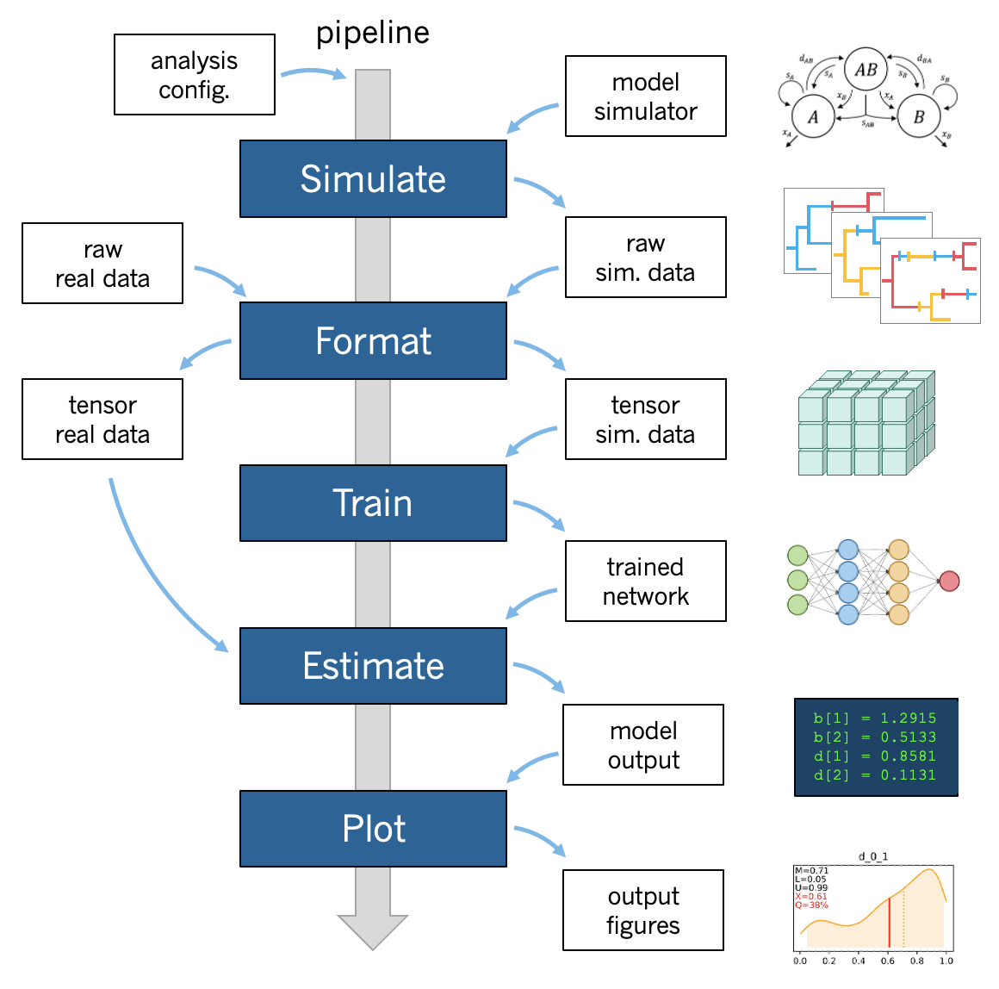

.. _Pipeline:

Pipeline
========
..
    This guide provides phyddle users with an overview for how the pipeline
    toolkit works, where it stores files, and how to interpret files and
    figures. Learn how to configure phyddle analyses by reading the
    :ref:`Configuration` documentation. 

.. note:: 
    
    This section describes how a standard phyddle pipeline analysis is
    configured and how settings determine the behavior of a phyddle analysis.
    Visit :ref:`Configuration` to learn how to assign settings for a phyddle
    analysis. Visit :ref:`Glossary` to learn more about
    how phyddle defines different terms



A phyddle pipeline analysis has five steps: :ref:`Simulate`, :ref:`Format`,
:ref:`Train`, :ref:`Estimate`, and :ref:`Plot`. Standard analyses run all
steps, in order for a single batch of settings. That said, steps can be run
multiple times under different settings and orders, which is useful for
exploratory and advanced analyses. Visit :ref:`Tricks` to learn how to use
phyddle to its fullest potential.

All pipeline steps create output files. All pipeline (except :ref:`Simulate`)
also require input files corresponding to at least one other pipeline step.
A full phyddle analysis for a *project* will automatically generate the
input files for downstream pipeline steps and store them in a predictable
*project directory*.

Users may also elect to use phyddle for only some steps in their analysis, and
produce files for other steps by different means. For example, :ref:`Format`
expects to format and combine large numbers of simulated datasets into tensor
formats that can be used for supervised learning with neural networks.
These simulated files can either be generated through phyddle with
the :ref:`Simulate` step or outside of phyddle entirely.

Below is the project directory structure that a standard phyddle analysis
would use. In this section, we assume the project ``dir`` is 
``./workspace/example``:

.. code-block:: shell

    Simulate 
    - input:   None
    - output:  ./workspace/example/simulate  # simulated datasets

    Format
    - input:   ./workspace/example/simulate  # simulated datasets
               ./workspace/example/empirical # empirical datasets
    - output:  ./workspace/example/format    # formatted datasets
  
    Train
    - input:   ./workspace/example/format    # simulated training dataset
    - output:  ./workspace/example/train     # trained network + train results
  
    Estimate
    - input:   ./workspace/example/format    # simulated test + empirical datasets
               ./workspace/example/train     # trained network
    - output:  ./workspace/example/estimate  # test + empirical results

    Plot
    - input:   ./workspace/example/format    # simulated training dataset
               ./workspace/example/train     # trained network and output
               ./workspace/example/estimate  # simulated + empirical estimates
    - output:  ./workspace/example/plot      # analysis figures


.. _Simulate:

Simulate
--------

:ref:`Simulate` instructs phyddle to simulate your training dataset. Any
simulator that can be called from command-line can be used to generate training
datasets with phyddle. This allows researchers to use their favorite simulator
with phyddle for phylogenetic modeling tasks.

As a worked example, suppose we have an R script called ``sim_bisse.R`` containing
the following code

.. code-block:: r

    #!/usr/bin/env Rscript
    library(castor)
    library(ape)

    # disable warnings
    options(warn = -1)

    # example command string to simulate for "sim.1" through "sim.10"
    # cd ~/projects/phyddle/workspace/example
    # Rscript sim_bisse.R ./simulate example 1 10

    # arguments
    args        = commandArgs(trailingOnly = TRUE)
    out_path    = args[1]
    out_prefix  = args[2]
    start_idx   = as.numeric(args[3])
    batch_size  = as.numeric(args[4])
    rep_idx     = start_idx:(start_idx+batch_size-1)
    num_rep     = length(rep_idx)
    get_mle     = FALSE

    # filesystem
    tmp_fn = paste0(out_path, "/", out_prefix, ".", rep_idx)  # sim path prefix
    phy_fn = paste0(tmp_fn, ".tre")               # newick file
    dat_fn = paste0(tmp_fn, ".dat.csv")           # csv of data
    lbl_fn = paste0(tmp_fn, ".labels.csv")        # csv of labels (e.g. params)

    # dataset setup
    num_states = 2
    tree_width = 500
    label_names = c(paste0("log10_birth_",1:num_states),
                    "log10_death", "log10_state_rate", "sample_frac")

    # simulate each replicate
    for (i in 1:num_rep) {

        # set RNG seed
        set.seed(rep_idx[i])

        # rejection sample
        num_taxa = 0
        while (num_taxa < 10) {

            # simulation conditions
            max_taxa = runif(1, 10, 5000)
            max_time = runif(1, 1, 100)
            sample_frac = 1.0
            if (max_taxa > tree_width) {
                sample_frac = tree_width / max_taxa
            }

            # simulate parameters
            Q = get_random_mk_transition_matrix(num_states, rate_model="ER",
                                                max_rate=0.1)
            birth = runif(num_states, 0, 1)
            death = min(birth) * runif(1, 0, 1.0)
            death = rep(death, num_states)
            parameters = list(
                birth_rates=birth,
                death_rates=death,
                transition_matrix_A=Q
            )

            # simulate tree/data
            res_sim = simulate_dsse(
                    Nstates=num_states,
                    parameters=parameters,
                    sampling_fractions=sample_frac,
                    max_extant_tips=max_taxa,
                    max_time=max_time,
                    include_labels=T,
                    no_full_extinction=T)

            # check if tree is valid
            num_taxa = length(res_sim$tree$tip.label)
        }

        # save tree
        tree_sim = res_sim$tree
        write.tree(tree_sim, file=phy_fn[i])

        # save data
        state_sim = res_sim$tip_states - 1
        df_state = data.frame(taxa=tree_sim$tip.label, data=state_sim)
        write.csv(df_state, file=dat_fn[i], row.names=F, quote=F)

        # save learned labels (e.g. estimated data-generating parameters)
        label_sim = c(birth[1], birth[2], death[1], Q[1,2], sample_frac)
        label_sim = log(label_sim, base=10)
        names(label_sim) = label_names
        df_label = data.frame(t(label_sim))
        write.csv(df_label, file=lbl_fn[i], row.names=F, quote=F)

    }


    # done!
    quit()
  

This particular script has a few important features. First, the simulator is
entirely responsible for simulating the dataset. Second, the script assumes it
will be provided runtime arguments (``args```) to generate filenames and to
determine how many simulated datasets will be generated when the script is run
(more details in next paragraph). Third, output for the Newick string is stored
into a ``.tre`` file, for the character matrix data into a ``.dat.csv`` file,
and for the training labels into a comma-separated ``.csv`` file.

Now that we understand the script, we need to configure phyddle to call it
properly. This is done by setting the ``sim_command`` argument equal to a
command string of the form ``MY_COMMAND [MY_COMMAND_ARGUMENTS]``. During
simulation, phyddle executes the command string against different filepath
locations. More specifically, phyddle will execute the command
``MY_COMMAND [MY_COMMAND_ARGUMENTS] [SIM_DIR] [SIM_PREFIX]``, where ``SIM_DIR``
is the path to the directory locating the individual simulated datasets, and 
``SIM_PREFIX`` is a common prefix shared by individual simulation files. As
part of the Simulate step, phyddle will execute the command string to generate
the complete simulated dataset of replicated training examples.

In this case, we assume that `sim_bisse.R` is an R script that is located in
the same directory as `config.py` and can be executed using the `Rscript` 
command. The correct `sim_command` value to run this script is:

.. code-block:: python

    'sim_command' : 'Rscript ./sim_bisse.R'

Assuming ``sim_dir = './simulate'``, ``sim_prefix = 'sim'``
``sim_batch_size = 10``, phyddle will execute the commands during simulation

.. code-block:: shell

    Rscript sim_one.R ./simulate/ sim 0 10
    Rscript sim_one.R ./simulate/ sim 10 10
    Rscript sim_one.R ./simulate/ sim 20 10
    ...

for every replication index between ``start_idx`` and ``end_idx`` in
increments of ``sim_batch_size``, where the R script itself is responsible
for generating the ``sim_batch_size`` replicates per batch. In fact,
executing ``Rscript sim_bisse.R ./simulate/ sim 1 10``
from terminal is an ideal way to validate that your custom simulator is
compatible with the phyddle requirements.


.. _Format:

Format
------

:ref:`Format` converts simulated and/or empirical data for a project into a
tensor format that phyddle uses to train neural networks in the :ref:`Train`
step. :ref:`Format` performs two main tasks:

1. Encode all individual raw datasets in the simulate and empirical project
   directory into individual tensor representations
2. Combines all the individual tensors into larger, singular tensors that can
   be processed by the neural network

For each example, :ref:`Format` encodes the raw data into two input
tensors and one output tensor:

- One input tensor is the **phylogenetic-state tensor**. Loosely speaking,
  these tensors contain information associated with clades across rows and
  information about relevant branch lengths and states per taxon across columns.
  The phylogenetic-state tensors used by phyddle are based on the compact
  bijective ladderized vector (**CBLV**) format of Voznica et al. (2022) and
  the compact diversity-reordered vector (**CDV**) format of
  Lambert et al. (2022) that incorporates tip states (**CBLV+S** and **CDV+S**)
  using the technique described in Thompson et al. (2022).
- The second input is the **auxiliary data tensor**. This tensor contains
  summary statistics for the phylogeny and character data matrix and "known"
  parameters for the data generating process.
- The output tensor reports **labels** that are generally unknown data
  generating parameters to be estimated using the neural network. Depending on
  the estimation task, all or only some model parameters might be treated as
  labels for training and estimation.

For most purposes within phyddle, it is safe to think of a tensor as an
n-dimensional array, such as a 1-d vector or a 2-d matrix. The tensor encoding
ensures training examples share a standard shape (e.g. numbers of rows and
columns) that helps the neural network to detect predictable data patterns.
Learn more about the formats of phyddle tensors on the
:ref:`Tensor Formats <Tensor_Formats>` page.

During tensor-encoding, :ref:`Format` processes the tree, data matrix, and
model parameters for each replicate. This is done in parallel, when the setting
``use_parallel`` is set to ``True``. Simulated data are processed using CBLV+S
format if ``tree_encode`` is set to ``'serial'``. If ``tree_encode`` is set to
``'extant'`` then all non-extant taxa are pruned, saved as ``pruned.tre``, then
encoded using CDV+S. Standard CBLV+S and CDV+S formats are used when
``brlen_encode`` is ``'height_only'``, while additional branch length
information is added as rows when ``brlen_encode`` is set to
``'height_brlen'``. Each tree is then encoded into a phylogenetic-state tensor
with a maximum of ``tree_width`` sampled taxa. Trees that contain more taxa are
downsampled to ``tree_width`` taxa. The number of taxa in each original dataset
is recorded in the summary statistics, allowing the trained network to 
make estimates on trees that are larger or smaller than th exact ``tree_width``
size. 

The phylogenetic-state tensors and auxiliary data tensors are then created. If
``save_phyenc_csv`` is set, then individual csv files are saved for each
dataset, which is especially useful for formatting new empirical datasets into
an accepted phyddle format.

The ``param_est`` setting identifies which "unknown"
parameters in the labels tensor you want to treat as downstream estimation
targets. The ``param_data`` setting identifies which of those parameters you
want to treat as "known" auxiliary data.

.. code-block:: python

    # Settings in config.py

    # "unknown" parameters to estimate
    'param_est' : {
        'log10_birth_rate' : 'real',
        'log10_death_rate' : 'real',
        'log10_transition_matrix' : 'real',
        'model_type' : 'cat',
        'root_state' : 'cat'
    }
    
    # "known" parameters to use as auxiliary data
    'param_data' : {
        'sample_frac' : 'real'
    }
  
Information for ``param_est`` and ``param_data`` are each stored as dictionaries.
The keys are the names of the parameters (labels) generated by the :ref:`Simulate`
step. The values are the data types of the parameters. Data types may be either
``'real'`` for real-valued parameters, or ``'cat'`` for categorical parameters. 

.. note::

    Real-valued parameters have ordered values that are negative, positive,
    or zero. We recommend that you transform numerical parameters into
    real values for use with phyddle. For example, although an evolutionary
    rate parameter is non-negative, the log of that rate can be negative,
    positive, or zero.
    
.. note::

    Categorical parameters have unordered values. They are encoded using 
    base-0 sequential integers. For example, the nucleotides for an ancestral
    state estimation task would use ``0, 1, 2, 3`` to represent A, C, G, T.

Lastly, Format creates a test dataset containing proportion ``test_prop`` of
all simulated examples, and a second training dataset that contains all
remaining ``1.0 - test_prop`` examples.

Formatted tensors are then saved to disk either in simple comma-separated
value format or in a compressed HDF5 format. For example, suppose we set
``fmt_dir`` to ``'./format'``, ``fmt_prefix`` to ``'out'``,
and ``tree_encode`` to ``'serial'``. If we set ``tensor_format == 'hdf5'``,
it produces:

.. code-block:: shell

    ./format/out.empirical.hdf5
    ./format/out.test.hdf5
    ./format/out.train.hdf5

or if ``tensor_format == 'csv'``:

.. code-block:: shell

    ./format/out.empirical.aux_data.csv
    ./format/out.empirical.labels.csv
    ./format/out.empirical.phy_data.csv
    ./format/out.test.aux_data.csv
    ./format/out.test.labels.csv
    ./format/out.test.phy_data.csv
    ./format/out.train.aux_data.csv
    ./format/out.train.labels.csv
    ./format/out.train.phy_data.csv

:ref:`Format` behaves the same way for simulated vs. empirical datasets,
except in two key ways. First, simulated datasets will be split into datasets
used to train the neural network and test its accuracy (in proportions defined
by ``test_prop``), whereas empirical datasets are left whole. Second, simulated
datasets will contain labels for all data-generating parameters, meaning both 
the "unknown" parameters that we want to estimate and the "known" parameters
that contribute to the data-generating process, but could be measured in the 
real world. For example, the birth rate might be an "unknown" parameter we want 
to estimate, while the missing proportion of species is a "known" parameter 
that we can provide the network if we know e.g. only 10% of described
plant species are in the dataset.

When searching for empirical and simulated datasets, :ref:`Format` uses
``emp_dir`` and ``sim_dir`` to locate the datasets. The ``emp_prefix`` and
``sim_prefix`` settings are used to identify the datasets. :ref:`Format`
assumes that empirical datasets follow the naming pattern of
``<prefix>.<rep_idx>.<ext>`` described for :ref:`Simulate`. For example,
setting ``emp_dir`` to ``'../dnds/empirical'`` and ``emp_prefix``
to ``'mammal_gene'`` will cause :ref:`Format` to search for files with
these names:

.. code-block:: shell

    ../dnds/empirical/mammal_gene.1.tre
    ../dnds/empirical/mammal_gene.1.dat.csv
    ../dnds/empirical/mammal_gene.1.labels.csv  # if using known params
    ../dnds/empirical/mammal_gene.2.tre
    ../dnds/empirical/mammal_gene.2.dat.csv
    ../dnds/empirical/mammal_gene.2.labels.csv  # if using known params
    ...

Using the ``--no_emp`` or ``--no_sim`` flags will instruct :ref:`Format` to
skip processing the empirical and simulated datasets, respectively. In
addition, :ref:`Format` will report that it is skipping the empirical and
simulated datasets if they do not exist.

Once complete, the formatted files can then be processed by the
:ref:`Train` step and :ref:`Estimate` steps.


.. _Train:

Train
-----

:ref:`Train` builds a neural network and trains it to make model-based
estimates using the simulated training example tensors compiled by the
:ref:`Format` step.

The :ref:`Train` step performs six main tasks:

1. Load the input training example tensor.
2. Shuffle the input tensor and split it into training, test, validation, and calibration subsets.
3. Build and configure the neural network
4. Use supervised learning to train neural network to make accurate estimates (predictions)
5. Record network training performance to file
6. Save the trained network to file

Each network is trained for one set of prediction tasks for the exact model
as specified for the :ref:`Simulate` step. Each network is trained to
expect a specific set of :ref:`Format` settings (see above).
Important :ref:`Format` settings include ``tree_width``, ``num_char``,
``num_states``, ``char_encode``, ``tree_encode``, ``brlen_encode``,
``param_est``, and ``param_known``. 

When the training dataset is read in, its examples are randomly shuffled by
replicate index. It then sets aside some examples for a validation dataset
(``prop_val``) and others for a calibration dataset (``prop_cal``). Note, 
the :ref:`Format` step will have previously set aside some proportion of test 
number of examples (``prop_test``) to measure final network accuracy
during the later :ref:`Estimate` step. The ``prop_val`` and ``prop_cal``
are themselves proportions of the ``1.0 - prop_test`` training example
proportion.

phyddle uses `PyTorch <https://pytorch.org/>` to build and train the network.
The phylogenetic-state tensor is processed by convolutional and pooling layers,
while the auxiliary data is processed by dense layers. All input layers are
concatenated then pushed into three branches terminating in output layers
to produce point estimates and upper and lower estimation intervals. Here
is a simplified schematic of the network architecture:

.. code-block::

    Simplified network architecture:
                              
                         Phylo. Data                  Aux. Data
                            Input                       Input
                              |                           |
                .-------------+-------------.             |
               v              v              v            v
        Conv1D-plain   Conv1D-dilate   Conv1D-stride    Dense
           + Pool         + Pool          + Pool          |
               .              |              |            |
                `-------------+----+---------+-----------'
                                   |
                                   v
                                 Concat
                                + Dense
                                   |     
                .-----------+------+-----+-----------.
               v            v            v            v
             Lower        Point        Upper        Categ.
            quantile     estimate     quantile    estimates


Parameter point estimates use a loss function (e.g. ``loss`` set to ``'mse'``;
Tensorflow-supported string or function) while lower/upper quantile estimates
use a pinball loss function (hard-coded). Each categorical parameter is trained
using a separate cross-entropy loss function.

Calibrated prediction intervals (CPIs) are estimated using the conformalized
quantile regression technique of Romano et al. (2019). CPIs target a
particular estimation interval, e.g. set ``cpi_coverage`` to ``0.80`` so
80% of test estimations are expected contain the true simulating value.
More accurate CPIs can be obtained using two-sided conformalized quantile
regression by setting ``cpi_asymmetric`` to ``True``, though this often
requires larger numbers of calibration examples, determined through
``prop_cal``. 

The network is trained iteratively for ``num_epoch`` training cycles using
batch stochastic gradient descent, with batch sizes given by ``trn_batch_size``.
Different optimizers can be used to update network weight and bias
parameters (e.g. ``optimizer == 'adam'``; Tensorflow-supported string
or function). Network performance is also evaluated against validation data
set aside with ``prop_val`` that are not used for minimizing the loss function.

Number of layers and numbers of nodes per layer can be adjusted using
configuration settings. For example, setting ``phy_channel_plain`` to
``[64,96,128]`` will construct three convolutional layers with 64, 96, and 128
output channels, respectively.

Training is automatically parallelized using CPUs and GPUs, dependent on
how Tensorflow was installed and system hardware. Output files are stored
in the directory assigned to ``trn_dir``.


.. _Estimate:

Estimate
--------

:ref:`Estimate` loads the simulated and empirical test datasets created by
:ref:`Format` stored in ``fmt_dir`` with prefix ``fmt_prefix``. For example,
if ``fmt_dir == './format'``, ``fmt_prefix == 'out'``,
and ``tensor_format == 'hdf5'`` then :ref:`Estimate` will process the
following files, if they exist: 

.. code-block:: shell

    ./out.test.hdf5
    ./out.empirical.hdf5

This step then loads a pretrained network for a given ``tree_width`` and
uses it to estimate parameter values and calibrated prediction intervals
(CPIs) for both the empirical dataset and the (simulated) test dataset.
Estimates are then stored as separate files into the ``est_dir`` directory.

Using the ``--no_emp`` or ``--no_sim`` flags will instruct :ref:`Estimate` to
skip processing the empirical and simulated datasets, respectively. In
addition, :ref:`Estimate` will report that it is skipping the empirical and
simulated datasets if they do not exist.


.. _Plot:

Plot
----

:ref:`Plot` collects all results from the :ref:`Format`, :ref:`Train`, and
:ref:`Estimate` steps to compile a set of useful figures, listed below. When 
results from :ref:`Estimate` are available, the step will integrate it into
other figures to contextualize where that input dataset and estimated
labels fall with respect to the training dataset.

Plots are stored within ``plot_dir``.
Colors for plot elements can be modified with ``plot_train_color``,
``plot_label_color``, ``plot_test_color``, ``plot_val_color``,
``plot_aux_color``, and ``plot_est_color`` using hex codes or common color
names supported by `Matplotlib <https://matplotlib.org/stable/gallery/color/named_colors.html>`__.

- ``summary.pdf`` contains all figures in a single plot
- ``summary.csv`` records important results in plain text format
- ``density_<dataset_name>_aux_data.pdf`` - densities of all values in the auxiliary dataset;
  red line for empirical dataset; run for training and empirical datasets
- ``density_<dataset_name>_label.pdf`` - densities of all values in the auxiliary dataset;
  red line for empirical dataset; run for training and empirical datasets
- ``pca_<dataset_name>_aux_data.pdf`` - pairwise PCA of all values in the auxiliary dataset;
  red dot for empirical dataset; run for training and empirical datasets
- ``pca_<dataset_name>_label.pdf`` - pairwise PCA of all values in the auxiliary dataset;
  red dot for empirical dataset; run for training and empirical datasets
- ``train_history.pdf`` - loss performance across epochs for test/validation
  datasets for entire network
- ``<dataset_name>_estimate_<real_label_name>.pdf`` - point estimates and calibrated
  estimation intervals of real-valued parameters for test or training datasets
- ``<dataset_name>_estimate_<cat_label_name>.pdf`` - confusion matrix of categorical
  parameters for test or training dataset
- ``empirical_estimate_real_<N>.pdf`` - simple plot of point estimates and
  calibrated prediction intervals for each empirical dataset
- ``empirical_estimate_cat_<N>.pdf`` - simple bar plot for each empirical dataset
- ``network_architecture.pdf`` - visualization of Tensorflow architecture


.. _Example:

Example run
-----------

The output of phyddle pipeline analysis will resemble this:

.. code-block::

    ┏━━━━━━━━━━━━━━━━━━━━━━┓
    ┃   phyddle   v0.1.1   ┃
    ┣━━━━━━━━━━━━━━━━━━━━━━┫
    ┃                      ┃
    ┗━┳━▪ Simulating... ▪━━┛
      ┃
      ┗━━━▪ output:  ./simulate
    
    ▪ Start time of 20:37:07
    ▪ Simulating raw data
    Simulating: 100%|█████████████████████████| 100/100 [00:20<00:00,  4.94it/s]
    ▪ Total counts of simulated files:
      ▪ 31030 phylogeny files
      ▪ 31030 data files
      ▪ 31030 labels files
    ▪ End time of 20:37:31 (+00:00:24)
    ... done!
    ┃                      ┃
    ┗━┳━▪ Formatting... ▪━━┛
      ┃
      ┣━━━▪ input:   ./empirical
      ┃              ./simulate
      ┗━━━▪ output:  ./format
    
    ▪ Start time of 20:37:32
    ▪ Collecting simulated data
    ▪ Encoding simulated data as tensors
    Encoding: 100%|██████████████████████| 31030/31030 [04:36<00:00, 112.08it/s]
    Encoding found 31030 of 31030 valid examples.
    ▪ Splitting into train and test datasets
    ▪ Combining and writing simulated data as tensors
    Making train hdf5 dataset: 29479 examples for tree width = 500
    Making test hdf5 dataset: 1551 examples for tree width = 500
    ▪ Collecting empirical data
    ▪ Encoding empirical data as tensors
    Encoding: 100%|█████████████████████████████| 10/10 [00:50<00:00,  5.08s/it]
    Encoding found 10 of 10 valid examples.
    ▪ Combining and writing empirical data as tensors
    Making empirical hdf5 dataset: 10 examples for tree width = 500
    ▪ End time of 20:43:21 (+00:05:49)
    ... done!
    ┗━┳━▪ Training...   ▪━━┛
      ┃
      ┣━━━▪ input:   ./format
      ┗━━━▪ output:  ./train
    
    ▪ Start time of 20:45:09
    ▪ Loading input:
      ▪ 22111 training examples
      ▪  5895 calibration examples
      ▪  1473 validation examples
    ▪ Training targets:
      ▪ log10_birth_1     [type: real]
      ▪ log10_birth_2     [type: real]
      ▪ log10_death       [type: real]
      ▪ log10_state_rate  [type: real]
    ▪ Building network
    ▪ Training network
    Training epoch 1 of 10: 100%|███████████████| 44/44 [00:50<00:00,  1.14s/it]
        Train        --   loss: 1.0648
        Validation   --   loss: 0.9459
    
    Training epoch 2 of 10: 100%|███████████████| 44/44 [00:49<00:00,  1.13s/it]
        Train        --   loss: 0.8429  abs: -0.2219  rel: -20.84%
        Validation   --   loss: 0.8125  abs: -0.1333  rel: -14.10%
    
    Training epoch 3 of 10: 100%|███████████████| 44/44 [00:49<00:00,  1.12s/it]
        Train        --   loss: 0.7646  abs: -0.0782  rel: -9.28%
        Validation   --   loss: 0.7716  abs: -0.0410  rel: -5.04%
    
    Training epoch 4 of 10: 100%|███████████████| 44/44 [00:49<00:00,  1.12s/it]
        Train        --   loss: 0.7218  abs: -0.0429  rel: -5.61%
        Validation   --   loss: 0.7275  abs: -0.0441  rel: -5.71%
    
    Training epoch 5 of 10: 100%|███████████████| 44/44 [00:48<00:00,  1.11s/it]
        Train        --   loss: 0.6917  abs: -0.0300  rel: -4.16%
        Validation   --   loss: 0.6930  abs: -0.0345  rel: -4.74%
    
    Training epoch 6 of 10: 100%|███████████████| 44/44 [00:48<00:00,  1.11s/it]
        Train        --   loss: 0.6657  abs: -0.0261  rel: -3.77%
        Validation   --   loss: 0.6874  abs: -0.0056  rel: -0.81%
    
    Training epoch 7 of 10: 100%|███████████████| 44/44 [00:49<00:00,  1.13s/it]
        Train        --   loss: 0.6417  abs: -0.0240  rel: -3.61%
        Validation   --   loss: 0.6621  abs: -0.0253  rel: -3.68%
    
    Training epoch 8 of 10: 100%|███████████████| 44/44 [00:50<00:00,  1.14s/it]
        Train        --   loss: 0.6264  abs: -0.0153  rel: -2.38%
        Validation   --   loss: 0.6549  abs: -0.0072  rel: -1.09%
    
    Training epoch 9 of 10: 100%|███████████████| 44/44 [00:49<00:00,  1.13s/it]
        Train        --   loss: 0.6144  abs: -0.0119  rel: -1.91%
        Validation   --   loss: 0.6376  abs: -0.0173  rel: -2.64%
    
    Training epoch 10 of 10: 100%|██████████████| 44/44 [00:49<00:00,  1.14s/it]
        Train        --   loss: 0.6078  abs: -0.0067  rel: -1.08%
        Validation   --   loss: 0.6307  abs: -0.0069  rel: -1.08%
    
    ▪ Processing results
    ▪ Saving results
    ▪ End time of 20:53:47 (+00:08:38)
    ▪ ... done!
    ┃                      ┃
    ┗━┳━▪ Estimating... ▪━━┛
      ┃
      ┣━━━▪ input:   ./format
      ┃              ./train
      ┗━━━▪ output:  ./estimate
    
    ▪ Start time of 20:53:47
    ▪ Estimation targets:
      ▪ log10_birth_1     [type: real]
      ▪ log10_birth_2     [type: real]
      ▪ log10_death       [type: real]
      ▪ log10_state_rate  [type: real]
    ▪ Loading simulated test input
    ▪ Making simulated test estimates
    ▪ Loading empirical input
    ▪ Making empirical estimates
    ▪ End time of 20:53:49 (+00:00:02)
    ... done!
    ┃                      ┃
    ┗━┳━▪ Plotting...   ▪━━┛
      ┃
      ┣━━━▪ input:   ./format
      ┃              ./train
      ┃              ./estimate
      ┗━━━▪ output:  ./plot
    
    ▪ Start time of 20:55:18
    ▪ Loading input
    ▪ Generating individual plots
    ▪ Combining plots
    ▪ Making csv report
    ▪ End time of 20:55:35 (+00:00:17)
    ... done!
