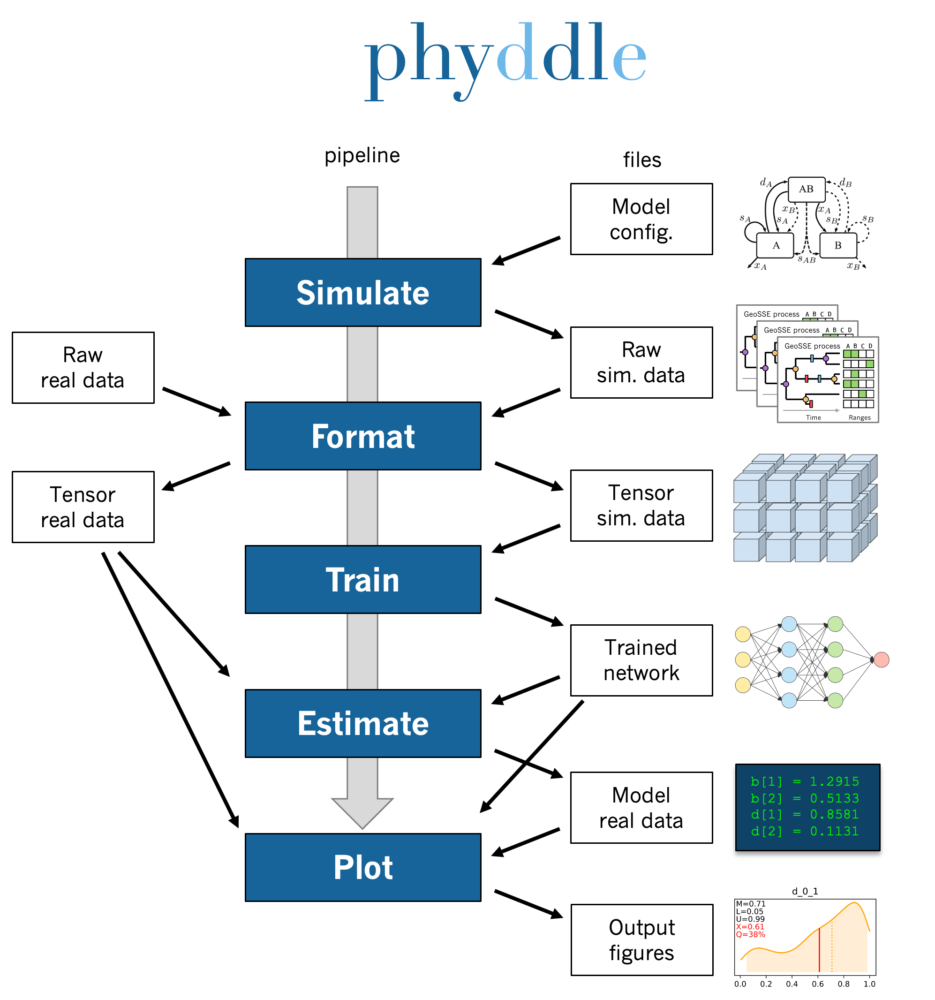

.. _Pipeline:

Pipeline
========
..
    This guide provides phyddle users with an overview for how the pipeline
    toolkit works, where it stores files, and how to interpret files and
    figures. Learn how to configure phyddle analyses by reading the
    :ref:`Configuration` documentation. 

.. note:: 
    
    This section describes how a standard phyddle pipeline analysis is
    configured and how settings determine the behavior of a phyddle analysis.
    Visit :ref:`Configuration` to learn how to assign settings for a phyddle
    analysis. Visit :ref:`Glossary` to learn more about
    how phyddle defines different terms

A phyddle pipeline analysis has five steps: :ref:`Simulate`, :ref:`Format`,
:ref:`Train`, :ref:`Estimate`, and :ref:`Plot`. Standard analyses run all
steps, in order for a single batch of settings. That said, steps can be run
multiple times under different settings and orders, which is useful for
exploratory and advanced analyses. Visit :ref:`Tricks` to learn how to use
phyddle to its fullest potential.

All pipeline steps create output files. All pipeline (except :ref:`Simulate`)
also require input files corresponding to at least one other pipeline step.
A full phyddle analysis for a *project* will automatically generate the
input files for downstream pipeline steps and store them in a predictable
*project directory*.

Users may also elect to use phyddle for only some steps in their analysis, and
produce files for other steps by different means. For example, :ref:`Format`
expects to format and combine large numbers of simulated datasets into tensor
formats that can be used for supervised learning with neural networks.
These simulated files can either be generated through phyddle with
the :ref:`Simulate` step or outside of phyddle entirely.

Below is the project directory structure that a standard phyddle analysis
would use. In general, we assume the project name is ``example``:

.. code-block:: shell

    Simulate 
    - input:   None
    - output:  workspace/simulate/example  # simulated datasets

    Format
    - input:   workspace/simulate/example  # simulated datasets
    - output:  workspace/format/example    # formatted datasets
  
    Train
    - input:   workspace/format/example    # simulated training dataset
    - output:  workspace/train/example     # trained network + results
  
    Estimate
    - input:   workspace/format/example    # simulated test dataset
               workspace/train/example     # trained network
               workspace/estimate/example  # new (emprical) dataset
    - output:  workspace/estimate/example  # new (empirical) estimates

    Plot
    - input:   workspace/format/example    # simulated training dataset
               workspace/train/example     # trained network and output
               workspace/estimate/example  # new (empirical) dataset & estimates
    - output:  workspace/plot/example      # analysis figures

.. _Simulate:

Simulate
--------

:ref:`Simulate` instructs phyddle to simulate your training dataset. Any
simulator that can be called from command-line can be used to generate training
datasets with phyddle. This allows researchers to use their favorite simulator
with phyddle for phylogenetic modeling tasks.

As a worked example, suppose we have an R script called ``sim_one.R`` containing
the following code

.. code-block:: r

    # load library
    library(ape)
    
    # gather arguments
    args = commandArgs(trailingOnly = TRUE)
    
    # simulated file names
    tmp_fn = args[1]
    phy_fn  = paste0(tmp_fn, ".tre")
    dat_fn  = paste0(tmp_fn, ".dat.nex")
    lbl_fn  = paste0(tmp_fn, ".param_row.csv")
    
    # simulation parameters
    birth = rexp(1)
    death = birth * runif(1)
    rate = rexp(1)
    max_time = runif(1,0,10)
    
    # simulate training data
    phy = rbdtree(birth=birth, death=death, Tmax=max_time)
    dat = rTraitDisc(phy, model="ER", k=2, rate=rate, state_labels=c(0,1))
    dat = dat - 1  # re-index states from 1/2 to 0/1
    
    # collect training labels
    lbl_vec = c(birth=birth, death=death, rate=rate)
    lbl = data.frame(t(lbl_vec))
    
    # save training example
    write.tree(phy, file=phy_fn)
    write.nexus.data(dat, file=dat_fn, format="standard", datablock=T)
    write.csv(lbl, file=lbl_fn, row.names=F, quote=F)

    # done!
    quit()

This script has a few important features. First, the simulator is entirely
reponsible for simulating the dataset. Second, the script assumes it will be
provided a runtime argument (``args[1]``) to generate filenames for the training
example. Third, output for the Newick string is stored into a ``.tre`` file,
for the character matrix data into a ``.dat.nex`` Nexus file, and for the
training labels into a comma-separated ``.csv`` file.

Now that we understand thee script, we need to configure phyddle to call it
properly. This is done by setting the ``sim_command`` argumetn equal to a
command string of the form ``MY_COMMAND [MY_COMMAND_ARGUMENTS]``. During
simulation, phyddle executes the command string against different filepath
locations. More specifically, phyddle will execute the command
``MY_COMMAND [MY_COMMAND_ARGUMENTS] SIM_PREFIX``, where ``SIM_PREFIX`` contains
the beginning of the filepath locating for an individual simulated dataset. As
part of the Simulate step, phyddle will execute the command string against a
range of values of ``SIM_PREFIX`` generates the complete simulated dataset of
replicated training examples.

The correct ``sim_command`` is:

.. code-block:: python

    'sim_command' : 'Rscript sim_one.R'

Assuming ``sim_dir = ../workspace/simulate`` and ``proj = my_project``, phyddle
will execute the commands during simulation

.. code-block:: shell

    Rscript sim_one.R ../workspace/simulate/my_project/sim.0
    Rscript sim_one.R ../workspace/simulate/my_project/sim.1
    Rscript sim_one.R ../workspace/simulate/my_project/sim.2
    ...

for every replication index between ``start_idx`` and ``end_idx``.
In fact, executing ``Rscript sim_one.R ../workspace/simulate/my_project/sim.0`` from terminal is the perfect way to validate that your custom simulator is compatible with the phyddle requirements.

.. _Format:

Format
------

:ref:`Format` converts the simulated data for a project into a tensor format
that phyddle uses to train neural networks in the :ref:`Train` step.
:ref:`Format` performs two main tasks:

1. Encode all individual raw datasets in the simulate project directory into
   individual tensor representations
2. Combines all the individual tensors into larger, singular tensors to act
   as the training dataset

For each simulated example, :ref:`Format` encodes the raw data into two input
tensors and one output tensor:

- One input tensor is the **phylogenetic-state tensor**. Loosely speaking,
  these tensors contain information about terminal taxa across columns and
  information about relevant branch lengths and states per taxon across rows.
  The phylogenetic-state tensors used by phyddle are based on the compact
  bijective ladderized vector (**CBLV**) format of Voznica et al. (2022) and
  the compact diversity-reordered vector (**CDV**) format of
  Lambert et al. (2022) that incorporates tip states (**CBLV+S** and **CDV+S**)
  using the technique described in Thompson et al. (2022).
- The second input is the **auxiliary data tensor**. This tensor contains
  summary statistics for the phylogeny and character data matrix and "known"
  parameters for the data generating process.
- The output tensor reports **labels** that are generally unknown data
  generating parameters to be estimated using the neural network. Depending on
  the estimation task, all or only some model parameters might be treated as
  labels for training and estimation.

For most purposes within phyddle, it is safe to think of a tensor as an
n-dimensional array, such as a 1-d vector or a 2-d matrix. The tensor encoding
ensures training examples share a standard shape (e.g. numbers of rows and
columns) that helps the neural network to detect predictable data patterns.
Learn more about the formats of phyddle tensors on the
:ref:`Tensor Formats <Tensor_Formats>` page.

During tensor-encoding, :ref:`Format` processes the tree, data matrix, and
model parameters for each replicate. This is done in parallel, when the
setting ``use_parallel`` is set to ``True``. Simulated data are processed
using CBLV+S format if ``tree_type`` is set to ``'serial'``. If ``tree_type``
is set to ``'extant'`` then all non-extant taxa are pruned, saved as
``pruned.tre``, then encoded using CDV+S. Each tree is then encoded into a
phylogenetic-state tensor with a maximum of ``tree_width`` sampled taxa. Trees
that contain more taxa are downsampled to ``tree_width`` taxa. The number of
taxa in each original dataset is recorded in the summary statistics, regardless
of its size. The phylogenetc-state tensors and auxiliary data tensors are
then created. If ``save_phyenc_csv`` is set, then individual csv files are
saved for each dataset, which is especially useful for formatting new empirical
datasets into an accepted phyddle format. The ``param_est`` setting identifies
which parameters in the labels tensor you want to treat as downstream
estimation targets. The ``param_data`` setting identifies which of those
parameters you want to treat as "known" auxiliary data. Lastly, Format creates
a test dataset containing proportion `test_prop` of examples, and a second
training dataset that contains all remaining examples.

Formatted tensors are then saved to disk either in simple comma-separated
value format or in a compressed HDF5 format. For example, suppose we set
``fmt_dir`` to ``'format'``, ``proj`` to ``'example'``, and ``tree_encode``
to ``'serial'``. If we set ``tensor_format`` to ``'hdf5'`` it produces:

.. code-block:: shell

    workspace/format/example/test.nt200.hdf5
    workspace/format/example/train.nt200.hdf5

or if ``tensor_format == 'csv'``:

.. code-block:: shell

    workspace/format/example/test.nt200.aux_data.csv
    workspace/format/example/test.nt200.labels.csv
    workspace/format/example/test.nt200.phy_data.csv
    workspace/format/example/train.nt200.aux_data.csv
    workspace/format/example/train.nt200.labels.csv
    workspace/format/example/train.nt200.phy_data.csv
	

These files can then be processed by the :ref:`Train` step.

.. _Train:

Train
-----

:ref:`Train` builds a neural network and trains it to make model-based
estimates using the training example tensors compiled by the :ref:`Format`
step.

The :ref:`Train` step performs six main tasks:
1. Load the input training example tensor.
2. Shuffle the input tensor and split it into training, test, validation, and calibration subsets.
3. Build and configure the neural network
4. Use supervised learning to train neural network to make accurate estimates (predictions)
5. Record network training performance to file
6. Save the trained network to file

When the training dataset is read in, its examples are randomly shuffled by
replicate index. It then sets aside some examples for a validation dataset
(``prop_val``) and others for a calibration dataset (``prop_cal``). Note, some
examples were already set aside for the training dataset during the
Format step (``prop_test``). All remaining examples are used for training.
A network must be trained against a particular ``tree_width`` size (see above). 

phyddle uses `TensorFlow <https://www.tensorflow.org/>`__ and
`Keras <https://keras.io/>`__ to build and train the network. The
phylogenetic-state tensor is processed by convolutional and pooling layers,
while the auxiliary data is processed by dense layers. All input layers are
concatenated then pushed into three branches terminating in output layers
to produce point estimates and upper and lower estimation intervals. Here
is a simplified schematic of the network architecture:

.. code-block::

    Simplified network architecture:

                              ,--> Conv1D-normal + Pool --.
        Phylo. Data Tensor --+---> Conv1D-stride + Pool ---\                          ,--> Point estimate
                              `--> Conv1D-dilate + Pool ----+--> Concat + Output(s)--+---> Lower quantile
                                                           /                          `--> Upper quantile
        Aux. Data Tensor   ------> Dense -----------------'

Parameter point estimates use a loss function (e.g. ``loss`` set to ``'mse'``;
Tensorflow-supported string or function) while lower/upper quantile estimates
use a pinball loss function (hard-coded).

Calibrated prediction intervals (CPIs) are estimated using the conformalized
quantile regression technique of Romano et al. (2019). CPIs target a
particular estimation interval, e.g. set ``cpi_coverage`` to ``0.95`` so
95% of test estimations are expected contain the true simulating value.
More accurate CPIs can be obtained using two-sided conformalized quantile
regression by setting ``cpi_asymmetric`` to ``True``, though this often
requires larger numbers of calibration examples, determined through
``prop_cal``. 

The network is trained iteratively for ``num_epoch`` training cycles using
batch stochastic gradient descent, with batch sizes given by ``batch_size``.
Different optimizers can be used to update network weight and bias
parameters (e.g. ``optimizer == 'adam'``; Tensorflow-supported string
or function). Network performance is also evaluated against validation data
set aside with ``prop_val`` that are not used for minimizing the loss function.

Training is automatically parallelized using CPUs and GPUs, dependent on
how Tensorflow was installed and system hardware. Output files are stored
in the directory assigned to ``trn_dir`` in the subdirectory ``proj``.

.. _Estimate:

Estimate
--------

:ref:`Estimate` loads the simulated test dataset saved with the format indicated
by ``tensor_format`` stored in ``<fmt_dir>/<fmt_proj>``. :ref:`Estimate` also
loads a new dataset stored in ``<est_dir>/<est_proj>`` with filenames
``<est_prefix.tre>`` and ``<est_prefix>.dat.nex``, if the new dataset exists.

This step then loads a pretrained network for a given ``tree_width`` and
uses it to estimate parameter values and calibrated prediction intervals
(CPIs) for both the new (empirical) dataset and the test (simulated) dataset.
Estimates are then stored as separated datasets into the original
``<est_dir>/<est_proj>`` directory.

.. _Plot:

Plot
----

:ref:`Plot` collects all results from the :ref:`Format`, :ref:`Train`, and
:ref:`Estimate` steps to compile a set of useful figures, listed below. When 
results from :ref:`Estimate` are available, the step will integrate it into
other figures to contextualize where that input dataset and estimateed
labels fall with respect to the training dataset.

Plots are stored within ``<plot_dir>`` in the ``<plot_proj>`` subdirectory.
Colors for plot elements can be modified with ``plot_train_color``,
``plot_label_color``, ``plot_test_color``, ``plot_val_color``,
``plot_aux_color``, and ``plot_est_color`` using hex codes or common color
names supported by `Matplotlib <https://matplotlib.org/stable/gallery/color/named_colors.html>`__.

- ``summary.pdf`` contains all figures in a single plot
- ``density_aux_data.pdf`` - densities of all values in the auxiliary dataset;
  red line for estimateed dataset
- ``density_label.pdf`` - densities of all values in the auxiliary dataset;
  red line for estimateed dataset
- ``pca_contour_aux_data.pdf`` - pairwise PCA of all values in the auxiliary dataset;
  red dot for estimateed dataset
- ``pca_contour_label.pdf`` - pairwise PCA of all values in the auxiliary dataset;
  red dot for estimateed dataset
- ``train_history.pdf`` - loss performance across epochs for test/validation
  datasets for entire network
- ``train_history_<stat_name>.pdf`` - loss, accuracy, error performance across
  epochs for test/validation datasets for particular statistics (point est.,
  lower CPI, upper CPI)
- ``estimate_train_<label_name>.pdf`` - point estimates and calibrated estimation
  intervals for training dataset
- ``estimate_test_<label_name>.pdf`` - point estimates and calibrated estimation
  intervals for test dataset
- ``estimate_new.pdf`` - simple plot of point estimates and calibrated estimation
  intervals for estimation
- ``network_architecture.pdf`` - visualization of Tensorflow architecture
