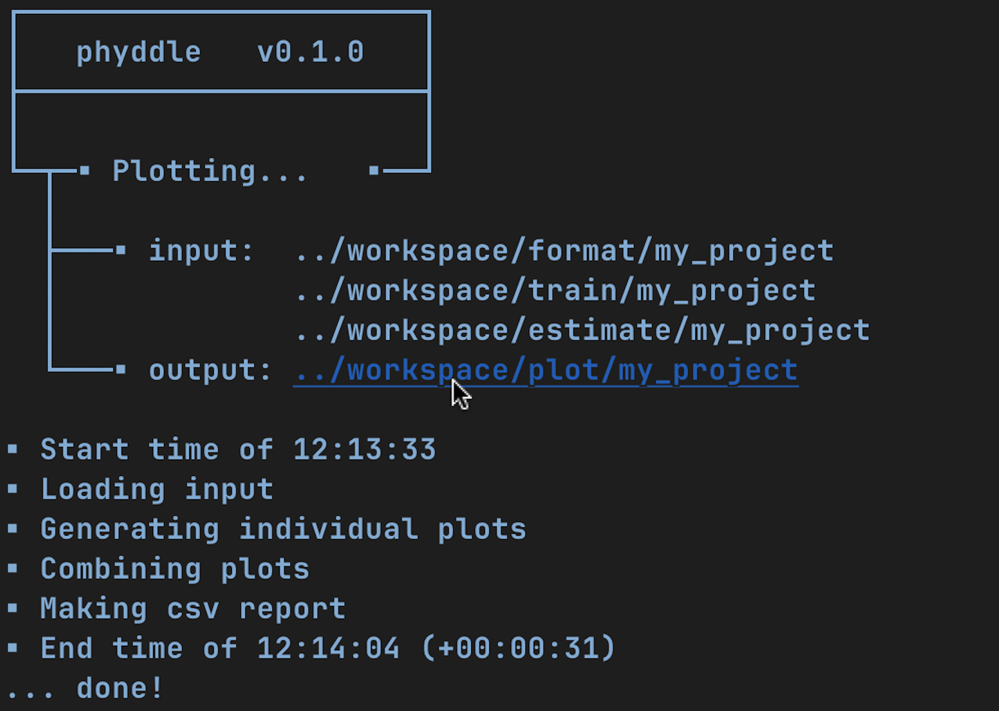

.. _Tricks:

Tricks
======

Here are a few tricks for using phyddle using a Unix-based terminal. These
commands assume a standard phyddle workspace directory structure.

**Make a new config file**

.. code-block:: shell

  # Create and modify new config file
  phyddle --make_cfg
  
  # Rename new config
  mv config_default.py my_new_config.py
  
  # Design new config
  edit my_new_config.py
  
  # Run using new config
  phyddle -c my_new_config.py

**Run a pipeline with modified command-line settings**

.. code-block:: shell
  
  # Run full pipeline while changing calibration and validation proportions 
  phyddle -c config.py --cal_prop 0.10 --val_prop 0.10

**Re-run part of the pipeline with modified command-line settings**

.. code-block:: shell

  # Re-run pipeline Train, Estimate, and Plot steps with new training settings
  phyddle -c config.py -s TEP --num_epoch 10 --trn_batch_size 64

**Redirect input/output across pipeline steps**

.. code-block:: shell
  
  # Run full pipeline 
  phyddle -c config.py
  
  # Re-run Train, Estimate, Plot steps with new settings, saved to other_project
  phyddle -c config.py \
          -s TEP \
          --trn_dir ../other_project/train \
          --est_dir ../other_project/estimate \
          --plt_dir ../other_project/plot \
          --num_epochs 40 \
          --trn_batch_size 512

  # Alternatively, point `dir` to other project point Format to this project
    phyddle -c config.py \
            -s TEP \
            --dir ../other_project \
            --fmt_dir ./format \
            --num_epochs 40 \
            --trn_batch_size 512

**Simulate new training examples**

.. code-block:: shell

  # Simulate training examples 0 to 999, storing results 
  # workspace/simulate/my_project
  phyddle -s S -c config.py --start_idx 0 --end_idx 1000

  # Simulate 4000 more training examples, 0 to 4999
  phyddle -s S -c config.py --sim_more 4000

  # Perform remaining Format, Train, Estimate, Plot steps
  phyddle -s FTEP -c config.py

  # ...or, to Simulate more and re-run all steps
  phyddle -c config.py --sim_more 4000

**Quick access to workspace directories from console via GUI**

On Mac OS X, you can press the Option key and click a directory path to open
a Finder window to that directory.

